# 2026-09-03 深度代码审查第二轮 Handoff

> **修正记录（2026-09-03 01:22）**：本文初稿经项目原始开发者审阅后，针对 5 条反驳逐一对照源码复核，确认 3 条反驳成立、1 条部分成立、1 条经验证不成立，已在正文中修正等级与措辞。具体调整见 §3 各条目内的【修正】标注。

## 1. 审查元数据

- **审查日期**：2026-09-03（第二轮）
- **审查分支**：`main`
- **审查范围**：在第一轮 handoff 文档 11 个已知问题的基础上，对项目全部源码进行第二轮逐行深度审查
- **已排除**：第一轮 [`2026-09-03-code-review-bugs-architecture-handoff.md`](file:///d:/AiPrograms/project1/docs/handoff/2026-09-03-code-review-bugs-architecture-handoff.md) 中已记录的 P0-1 至 P2-4 共 11 个问题（其中 5 个已修复）
- **审查方式**：4 个独立 AI 审查员分别负责 server/、前端工具模块（13 个文件）、app.js + 涨停模块、CSS/配置/HTML，并行全量审查
- **新发现缺陷**：**59 个**（修正后：高危 16 / 中危 27 / 低危 16）

> 注：初稿为高危 19 / 中危 24 / 低危 16。经开发者审阅后，S-HIGH-2 和 S-HIGH-4 降为 MED，C-HIGH-3 降为 LOW，净调整为高危 -3 / 中危 +3。

---

## 2. 审查结论摘要

第一轮 handoff 抓住了最显眼的阻断级 Bug，但项目底层存在 **6 个反复出现的系统性根因**，导致在各个模块中衍生出大量隐蔽缺陷：

1. **错误处理"吞噬"模式**：至少 8 处 catch 块静默吞噬关键异常，阻断自愈和上报路径
2. **共享可变状态无隔离**：模块级全局变量缺乏 scope 隔离和生命周期管理
3. **选择器/标识符碰撞**：同名标识在不同上下文中含义冲突
4. **定时器生命周期失控**：至少 5 处定时器存在泄漏或复活问题
5. **CSS 特异度与层叠失控**：缺少 CSS 架构方法论
6. **测试盲区**：567 个单测覆盖了 happy path，但边界条件和真实数据格式验证严重不足

---

## 3. 高危缺陷详细清单 (19 个)

---

### 一、会导致服务崩溃或数据永久损坏的后端缺陷 (6 个)

---

### S-HIGH-1：非法日期参数触发 Node.js 进程崩溃

- **代码位置**：[`server/index.js:49`](file:///d:/AiPrograms/project1/server/index.js#L49)、[`server/momentumService.js:408-410, 446`](file:///d:/AiPrograms/project1/server/momentumService.js#L408-L410)
- **根因分析**：
  POST 扫描接口未校验日期参数。`normalizeDateKey('invalid')` 返回空字符串 `''`，`cacheParts('', 45)` 生成非法路径段。`resolveCachePath` 抛出 `Error: Invalid cache path segment`。catch 块内（line 446）`writeMomentumProgress(parts, data)` 依然传入包含空段的 parts，二次抛错。外部调用方 `startTenDayMomentumScan` 未 await 也未 `.catch()` → 触发 `UnhandledPromiseRejection` → **Node 进程直接崩溃**
- **影响**：一个恶意或错误的 HTTP 请求即可击杀整个服务
- **修复方案**：
  1. POST 接口入口校验日期参数合法性
  2. 外部调用加 `.catch(err => log(err))`
  3. catch 块内避免再次写入非法 parts

---

### ~~S-HIGH-2~~ → S-MED-0【已修正】：合法空响应被永久固化为历史缓存（毒化不可逆）

> **【修正】** 初稿将触发条件描述为"AKTools 未启动"，经开发者指出后复核：AKTools 拒绝连接走 `errors.push()` → `throw`，不会到达 line 170 的 `return { items: [] }`。实际触发场景是**合法 HTTP 200 空响应**（如非交易日查询已退市股、或数据源返回空数组），此时无异常抛出，空数据被写入磁盘并永久生效。等级从 HIGH 下调为 **MED**。

- **代码位置**：[`server/intradayService.js:170-176`](file:///d:/AiPrograms/project1/server/intradayService.js#L170-L176)、[`server/limitUpService.js:34-37`](file:///d:/AiPrograms/project1/server/limitUpService.js#L34-L37)
- **根因分析**：
  当所有数据源均成功返回但 `hasItems(filtered)` 全部为 false（合法空响应）时，`fetchIntradayNetwork` 返回 `{ items: [] }`。`getOrRefresh` 将其作为有效结果写入磁盘。后续 `readHistoricalCache` 仅检查 `hasOwnProperty('data')`，有 `data` 属性即认定命中，**永远不过期**。
- **影响**：对已退市股或特定非交易日的查询会产生永久空缓存，用户无论刷新多少次都只看到空白
- **修复方案**：
  写入前校验 `items.length > 0`；或为历史缓存增加 `isEmpty` 标记，允许在后续请求中覆盖重试

---

### S-HIGH-3：并发写缓存因毫秒级时间戳碰撞导致 ENOENT 崩溃

- **代码位置**：[`server/cacheStore.js:75-82`](file:///d:/AiPrograms/project1/server/cacheStore.js#L75-L82)
- **根因分析**：
  临时文件名用 `${process.pid}.${Date.now()}.tmp`。同进程同毫秒写同一 key 时路径完全一致。第一个 `renameWithRetry` 成功将 tmp 移走，第二个遭遇 ENOENT。`retryable` 集合 `['EPERM', 'EACCES', 'EBUSY']` 不含 `ENOENT` → 直接抛 500
- **修复方案**：
  使用 `crypto.randomUUID()` 替代 `Date.now()` 生成唯一临时文件名；在 finally 中 `rm(tmp, { force: true })` 兜底清理

---

### ~~S-HIGH-4~~ → S-MED-0b【已修正】：`force: true` 被 `forceMinAgeMs` 延迟中和，残缺日 K 自愈推迟最多 1 小时

> **【修正】** 初稿称"完全中和、无法自愈"，经开发者指出后确认：`forceMinAgeMs` 为 1 小时，到期后 `force: true` 恢复生效，残缺缓存可被网络请求覆盖。准确描述应为"自愈被推迟最多 1 小时"，而非永久失效。等级从 HIGH 下调为 **MED**。

- **代码位置**：[`server/klineService.js:206-216`](file:///d:/AiPrograms/project1/server/klineService.js#L206-L216)
- **根因分析**：
  `getKlineDataForMomentum` 检测到覆盖不足后以 `force: true` 调用 `getOrRefresh`，但同时设置了 `forceMinAgeMs: LONG_KLINE_TTL_MS`（1 小时）。在 1 小时内，`force: true` 被静默拦截，缓存直接返回。调用方语义为"检测到覆盖不足，请立即刷新"，但实际行为为"1 小时内忽略此请求"。
- **影响**：该股票在最多 1 小时内持续判定为 `stale-kline`，扫描结果中显示为刷新失败，直到 `forceMinAgeMs` 过期后自愈
- **修复方案**：
  `forceMinAgeMs` 下调至 5~10 秒（仅防并发击穿），使覆盖不足的残缺缓存能尽快从网络拉取修复

---

### S-HIGH-5：东财失败计数冷却到期后不重置，单次偶发失败永久循环触发 60s 冷却

- **代码位置**：[`server/klineService.js:83-104`](file:///d:/AiPrograms/project1/server/klineService.js#L83-L104)
- **根因分析**：
  `eastmoneyFailures` 仅在请求成功时置 0（line 92）。连续失败 3 次进入 60s 冷却后，放行时计数仍为 3。下一个请求任意偶发失败 `+= 1` → 变为 4 ≥ 3 → 立即再次 60s 冷却。东财接口长期被废弃。
- **修复方案**：
  冷却到期放行时重置 `eastmoneyFailures = 0`

---

### S-HIGH-6：每次 GET 读缓存都触发全量磁盘重写（`touchCacheAccess` 读放大）

- **代码位置**：[`server/cacheStore.js:50, 57-70`](file:///d:/AiPrograms/project1/server/cacheStore.js#L50)
- **根因分析**：
  仅为更新 `lastAccessedAt` 时间戳，每次 HTTP GET 都执行：读文件 → JSON.parse → 全量 JSON.stringify → 写临时文件 → 原子重命名。对数兆大小的全市场快照，这是灾难性的 I/O 放大。
- **修复方案**：
  改为内存中维护 LRU 访问时间，或批量定期更新，严禁每次 GET 触发全量重写

---

### 二、直接导致核心功能失效的前端缺陷 (6 个)

---

### F-HIGH-1：腾讯行情量比字段索引完全错误，监控表量比永远为 0

- **代码位置**：[`src/js/parser.js:65`](file:///d:/AiPrograms/project1/src/js/parser.js#L65)
- **代码证据**：
  ```javascript
  volumeRatio: parseFloat(fields[78]) || 0,  // 错！应为 fields[49]
  ```
- **根因分析**：
  腾讯实时行情 `v_sh600519` 的字段分割中，`fields[49]` 才是量比，`fields[78]` 是空字符串。腾讯是默认主行情源 → 所有股票量比列永远显示 `0.00` 或 `--`
- **修复方案**：改为 `parseFloat(fields[49]) || 0`

---

### F-HIGH-2：新浪期货 URL 缺少下划线 `nf_` + 解析正则不匹配，期货行情完全失效

- **代码位置**：[`src/js/api.js:66`](file:///d:/AiPrograms/project1/src/js/api.js#L66)、[`src/js/parser.js:123`](file:///d:/AiPrograms/project1/src/js/parser.js#L123)
- **代码证据**：
  ```javascript
  // api.js — 请求发出 nfrb2505（缺 _），新浪返回空
  return `/api/sina/list=${list.join(',')}`;
  
  // parser.js — 正则字符集不含 _，无法匹配 hq_str_nf_rb2505
  const SINA_FUTURE_RE = /var\s+hq_str_(nf[a-z0-9]+)="([^"]*)"/gi;
  ```
- **影响**：期货行情 100% 失效。单测用无下划线 mock 掩盖了此问题
- **修复方案**：请求 URL 规范化 `nf_` 前缀；正则改为 `(nf_?[a-z0-9]+)`

---

### F-HIGH-3：09:25~09:30 集合竞价关键窗口被误判为 `pre-open`，暂停刷新 5 分钟

- **代码位置**：[`src/js/marketSession.js:21-28`](file:///d:/AiPrograms/project1/src/js/marketSession.js#L21-L28)
- **代码证据**：
  ```javascript
  if (t >= 9 * 60 + 15 && t < 9 * 60 + 25) return 'opening-auction';
  if (t >= 9 * 60 + 30 && t < 11 * 60 + 30) return 'trading';
  // 09:25~09:30 无分支 → 掉入 return 'pre-open'
  ```
- **影响**：开盘价刚出炉的最关键 5 分钟内停止行情刷新和语音播报
- **修复方案**：将 09:25~09:30 纳入 `opening-auction`

---

### F-HIGH-4：`inflightKline` 去重导致跨组件 Abort 误杀

- **代码位置**：[`src/js/api.js:355-388`](file:///d:/AiPrograms/project1/src/js/api.js#L355-L388)
- **根因分析**：
  去重 key 仅 `${code}|${period}`，不区分调用方 signal。组件 A 发起请求后组件 B 复用同一 Promise，A 销毁时 abort → B 的图表也中断报错
- **修复方案**：带独立 signal 的请求不应直接复用可能被其他组件 cancel 的 Promise

---

### F-HIGH-5：交易日历请求被 Abort 后永久缓存降级数据，节假日判定终身失效

- **代码位置**：[`src/js/tradeCalendar.js:55-67`](file:///d:/AiPrograms/project1/src/js/tradeCalendar.js#L55-L67)
- **根因分析**：
  第 57 行 AbortError 被 rethrow，但第 64 行外层 `.catch()` 无差别捕获并赋值 `cachedDates = _fallbackTradingDatesAround()`。后续 `if (cachedDates) return cachedDates;` 永不再请求真实日历 → 法定节假日判定在当前 SPA 生命周期内永久失效
- **修复方案**：AbortError 终止时不为 `cachedDates` 赋值

---

### F-HIGH-6：非交易时段 `isKlineCacheStale` 恒返回 `false`，盘后/周末显示过期数据

- **代码位置**：[`src/js/storage.js:272-278`](file:///d:/AiPrograms/project1/src/js/storage.js#L272-L278)
- **代码证据**：
  ```javascript
  if (!_isMarketOpen(now)) return false; // 致命逻辑短路
  ```
- **影响**：收盘后、周末期间所有 K 线缓存被认定"不过期"，可能显示数日前的盘中临时数据。`klineCachePrune()` 在非交易时段清理数量恒为 0
- **修复方案**：判断 `fetchedAt` 是否跨越了交易日结算节点

---

### 三、核心业务逻辑硬伤 (4 个)

---

### A-HIGH-1：炸板池数据被完全丢弃，涨停看板"炸板"分组常年为空

- **代码位置**：[`src/js/app.js:2177`](file:///d:/AiPrograms/project1/src/js/app.js#L2177)、[`src/js/limitUpApi.js:70-84`](file:///d:/AiPrograms/project1/src/js/limitUpApi.js#L70-L84)
- **根因分析**：
  `limitUpFetch()` 调用 `fetchLimitUpList` 仅返回涨停池。在共享缓存路径（line 73）：`if (payload && Array.isArray(payload.limitUpItems)) return payload.limitUpItems;` — `brokenItems` 被直接丢弃。
- **影响**：涨停看板"炸板"分组永远为空，全天数十只炸板股完全遗漏
- **修复方案**：改用 `fetchLimitUpAndBrokenList`，合并 `limitUpItems` 和 `brokenItems`

---

### A-HIGH-2：10 日涨幅核心指标 `gainPercent` 盘中完全冻结不更新

- **代码位置**：[`src/js/app.js:3640-3675`](file:///d:/AiPrograms/project1/src/js/app.js#L3640-L3659)
- **根因分析**：
  实时行情刷新只同步了 `price`, `changePercent`, `amount`，未根据新现价和 `startClose` 重新计算 `gainPercent`。DOM 局部更新 `updateMomentumQuoteCells` 也跳过了第 5 列（10日涨幅）
- **影响**：强势股表格最核心的指标盘中永久停留在初始扫描值

---

### A-HIGH-3：后台调度器无条件复活已停止的监控定时器

- **代码位置**：[`src/js/app.js:3713-3733`](file:///d:/AiPrograms/project1/src/js/app.js#L3713-L3733)
- **根因分析**：
  `applyDataRefreshSchedule` 每 30s 执行一次，未检查当前路由。即使在涨停页 `stopMonitorTimer()` 后，最多 30s 后调度器会重新 `setInterval(refreshNow, ...)`。与第一轮 handoff P2-3 形成双重问题。
- **修复方案**：检查当前活动视图，不在监控页时不复活 `state.timer`

---

### A-HIGH-4：TTS 语音播报无限堆积，5s 间隔塞入 10 条需 25s 读完

- **代码位置**：[`src/js/app.js:3018-3036`](file:///d:/AiPrograms/project1/src/js/app.js#L3018-L3036)
- **根因分析**：
  `speakSubscribed()` 每 5s 触发一次，不检查 `speechSynthesis.speaking` 也不清空队列。10 只自选股全部读完需 25s → 播报无限堆积、滞后数分钟，挤占价格警报
- **修复方案**：播报前检查 `speaking` 或清空陈旧排队；价格提醒最高优先级插队

---

### 四、会影响大量用户的 CSS/配置缺陷 (3 个)

---

### C-HIGH-1：Vite 代理全部缺失 `proxy.on('error')`，上游拒连可能崩溃开发服务器

> **【补注】** 开发者指出此结论基于静态分析，需要实际隔离运行验证。Node.js `http-proxy` 未监听 `error` 事件时遇 `ECONNREFUSED` 的行为取决于具体版本与 Vite 内部的错误边界。保留建议补充 `proxy.on('error')`（这是防御性最佳实践），但标注**待实测确认是否确实导致进程崩溃**。

- **代码位置**：[`vite.config.js:61-172`](file:///d:/AiPrograms/project1/vite.config.js#L61-L172)
- **根因分析**：
  所有外部代理仅配了 `proxy.on('proxyReq')`，无一监听 `proxy.on('error')`。AKTools 未启动时 `ECONNREFUSED` → Uncaught Exception → **Vite 进程崩溃退出**
- **修复方案**：为每个代理补充 `proxy.on('error', (err, req, res) => { res.writeHead(502); res.end(JSON.stringify({error: err.message})); })`

---

### C-HIGH-2：`.momentum-chart-host` 缺 `position: relative`，十字线浮层飞出容器

> **【复核】** 开发者反驳称元素同时带有 `chart-host` 类（[`app.js:1139`](file:///d:/AiPrograms/project1/src/js/app.js#L1139)：`class: 'momentum-chart-host chart-host'`），已能从 `.chart-host` 继承 `position: relative`。经逐行验证，**该反驳不成立**：`.chart-host` 独立规则（[`style.css:876-882`](file:///d:/AiPrograms/project1/src/style.css#L876-L882)）仅定义了 `width/height/background/border-radius/overflow`，**没有 `position: relative`**。全项目仅两处声明了 `position: relative`：`.intraday-chart-host`（line 559）和 `.watch-table tbody tr.chart-row .chart-host`（line 569，需嵌套在 `.watch-table` 中）。momentum 表不是 `.watch-table`，因此该元素确实缺少 `position: relative`。

- **代码位置**：[`src/style.css:760-767`](file:///d:/AiPrograms/project1/src/style.css#L760-L767)
- **根因分析**：
  监控表 `.chart-host`（line 567）和分时图容器（line 557）均有 `position: relative`，唯独 10 日涨幅 `.momentum-chart-host` 遗漏。`chart-crosshair-detail` 的 `position: absolute` 找不到定位父级，飞到页面顶部
- **修复方案**：`.momentum-chart-host` 补充 `position: relative;`

---

### ~~C-HIGH-3~~ → C-LOW-0【已修正】：移动端 Safari 将 6 位股票代码自动识别为电话号码

> **【修正】** 初稿列为 HIGH，经开发者指出后确认：此问题仅影响移动端 Safari（且非所有版本触发），不阻断核心功能。降为 **LOW** 级兼容性问题。

- **代码位置**：[`index.html:4-6`](file:///d:/AiPrograms/project1/index.html#L4-L6)
- **根因分析**：
  缺少 `<meta name="format-detection" content="telephone=no">`。`600519`、`000001` 被加下划线和拨号链接，点击触发拨号弹窗
- **修复方案**：`<head>` 补充 `<meta name="format-detection" content="telephone=no">`

---

## 4. 中危缺陷详细清单 (24 个)

---

### 后端中危 (4 个)

---

### S-MED-1：分时缓存 `-latest-` vs `-historical-` 键割裂，昨天完备数据次日找不到

- **代码位置**：[`server/intradayService.js:196-208`](file:///d:/AiPrograms/project1/server/intradayService.js#L196-L208)
- **根因分析**：
  当天保存在 `${dateKey}-latest-${safePrevClose}.json`。次日变为历史日期后查找 `${dateKey}-historical-${safePrevClose}.json` → 昨天的完备分时文件被无视，被迫重新走 AKTools 或降级
- **修复方案**：移除文件名中的 mode 区分，统一按日期持久化

---

### S-MED-2：`'complete'` 状态过于苛刻，success 备份永远不生成

- **代码位置**：[`server/momentumService.js:330, 425-427`](file:///d:/AiPrograms/project1/server/momentumService.js#L330)
- **根因分析**：
  A 股全市场 5,400+ 只中必然有 10~50 只停牌/退市股，`refreshFailures` 永远 > 0 → 状态永远 `partial` → `successCacheParts` 永远不写入 → 每次重启必全盘重扫
- **修复方案**：设置合理容忍度（如 98% 覆盖率或排除停牌股）作为基线保存条件

---

### S-MED-3：进度写入 IO 异常链式击穿，杀死整个 5000 只股票扫描

- **代码位置**：[`server/momentumService.js:320-325`](file:///d:/AiPrograms/project1/server/momentumService.js#L320-L325)
- **根因分析**：
  `progressWrite = progressWrite.then(() => writeMomentumProgress(parts, progress)); await progressWrite;`
  一次文件锁报错导致 `progressWrite` Rejected → 后续所有 worker 到达阈值时 `await progressWrite` 全部报错 → `Promise.all` 整体失败
- **修复方案**：为 `writeMomentumProgress` 包裹 `.catch(logAndIgnore)`

---

### S-MED-4：停止调度后在途任务 `.finally(scheduleNext)` 复活定时器

- **代码位置**：[`server/momentumService.js:477-498`](file:///d:/AiPrograms/project1/server/momentumService.js#L477-L498)
- **根因分析**：
  `stopMomentumScheduler()` 清除了 `schedulerTimer`，但在途任务完成后 `.finally(scheduleNext)` 未检查 `schedulerStarted` → 定时器死而复生
- **修复方案**：`scheduleNext` 首行增加 `if (!schedulerStarted) return;`

---

### 前端工具模块中危 (9 个)

---

### F-MED-1：开盘前 `open=0` 时 `openChangePercent` 误算为 `-100.00%`

- **代码位置**：[`src/js/parser.js:55, 115`](file:///d:/AiPrograms/project1/src/js/parser.js#L55)
- **修复方案**：增加 `open > 0` 前提校验

---

### F-MED-2：`normalizeCode` 不支持 15/16 开头的深市 ETF/基金

- **代码位置**：[`src/js/parser.js:11-16`](file:///d:/AiPrograms/project1/src/js/parser.js#L11-L16)
- **修复方案**：增加 `first === '1'` → `'sz' + raw`

---

### F-MED-3：科创板 `689xxx` CDR 涨跌幅限制被降级为 10%

- **代码位置**：[`src/js/kline.js:309-314`](file:///d:/AiPrograms/project1/src/js/kline.js#L309-L314)
- **修复方案**：`if (numeric.startsWith('688') || numeric.startsWith('689')) return 20;`

---

### F-MED-4：SWR revalidate 防抖锁过早释放，引发并发风暴

- **代码位置**：[`src/js/api.js:437-455`](file:///d:/AiPrograms/project1/src/js/api.js#L437-L455)
- **根因分析**：`_revalidatingKline.delete(key)` 在 `setTimeout` 回调首行同步执行，网络请求尚未完成，锁即失效
- **修复方案**：在 `refresh.finally(() => { _revalidatingKline.delete(key); })` 中释放

---

### F-MED-5：TTS `onerror` 未监听，失败 utterance 永久滞留 `_queue` 内存泄漏

- **代码位置**：[`src/js/tts.js:45-57`](file:///d:/AiPrograms/project1/src/js/tts.js#L45-L57)
- **修复方案**：同时监听 `utterance.onerror` 进行出队清理

---

### F-MED-6：分时获取在 shared-cache 404 但网络成功时误报"全部失败"

- **代码位置**：[`src/js/api.js:258-333`](file:///d:/AiPrograms/project1/src/js/api.js#L258-L275)
- **修复方案**：只有当所有兜底网络源也异常时，才汇入 sharedCacheError 报错

---

### F-MED-7：`setRaw` 吞噬 QuotaExceeded，50% LRU 修剪成死代码

- **代码位置**：[`src/js/storage.js:356-366`](file:///d:/AiPrograms/project1/src/js/storage.js#L356-L366)
- **修复方案**：`setRaw` 发生错误时向上抛出，或检查返回值触发修剪

---

### F-MED-8：`updateKline` 新柱 `prevClose` 为 null，十字线涨跌幅空白

- **代码位置**：[`src/js/chart.js:235-237`](file:///d:/AiPrograms/project1/src/js/chart.js#L235-L237)
- **修复方案**：新柱时取前一柱的收盘价作为 `prevClose`

---

### F-MED-9：Hash 路由全字匹配，带 `?query` 的 URL 被强制跳回首页

- **代码位置**：[`src/js/router.js:24-38`](file:///d:/AiPrograms/project1/src/js/router.js#L24-L38)
- **修复方案**：匹配前提取路径 `current.split('?')[0]`

---

### App.js 中危 (6 个)

---

### A-MED-1：`updateRowQuoteCells` 全局 `querySelector` 无作用域，串扰涨停表列

- **代码位置**：[`src/js/app.js:3622`](file:///d:/AiPrograms/project1/src/js/app.js#L3622)
- **根因分析**：`document.querySelector('tr[data-code="${code}"]')` 未限定在 `#watch-tbody` 内。涨停表也用 `data-code`，若命中涨停行会用监控表的列结构覆盖涨停表列
- **修复方案**：限定为 `document.querySelector('#watch-tbody tr[data-code="${code}"]')`

---

### A-MED-2：成功操作用 `flashError` 提示，底栏显示"错误: 已加入监控"

- **代码位置**：[`src/js/app.js:1776, 2379`](file:///d:/AiPrograms/project1/src/js/app.js#L1776)
- **修复方案**：区分 `flashError` 和 `flashInfo`，底栏 `renderStatus` 按类型渲染

---

### A-MED-3：涨停切日期未清理 `expandedCodes` 和 `chartInstances`

- **代码位置**：[`src/js/app.js:2293-2314`](file:///d:/AiPrograms/project1/src/js/app.js#L2293-L2314)
- **修复方案**：切换日期时调用 `closeAllLimitUpCharts()` 清理展开状态

---

### A-MED-4：实时价格富化与龙虎榜原因并行竞态相互覆盖

- **代码位置**：[`src/js/app.js:2182-2291`](file:///d:/AiPrograms/project1/src/js/app.js#L2182-L2192)
- **修复方案**：串行化两个富化步骤，或在合并时保留已有的 reason 字段

---

### A-MED-5：`sorted.reverse()` 暴力反转多级排序决胜字段

- **代码位置**：[`src/js/limitUp.js:183-188`](file:///d:/AiPrograms/project1/src/js/limitUp.js#L183-L188)
- **修复方案**：在比较函数中引入 `direction` 符号乘数

---

### A-MED-6：周末点击"前一天"跳过紧邻的上一个真实交易日

- **代码位置**：[`src/js/tradeCalendar.js:116-123`](file:///d:/AiPrograms/project1/src/js/tradeCalendar.js#L116-L123)
- **修复方案**：`date` 不在 `dates` 集合中且 `delta < 0` 时，首次返回 `resolveLatestTradingDate(date)` 本身

---

### CSS/配置中危 (5 个)

---

### C-MED-1：移动端图表高度特异度被桌面规则覆盖，媒体查询失效

- **代码位置**：[`src/style.css:567 vs 885`](file:///d:/AiPrograms/project1/src/style.css#L567)
- **根因分析**：桌面端 `.watch-table tbody tr.chart-row .chart-host` 特异度 `(0,3,2)`；媒体查询内 `.chart-host` 特异度 `(0,1,0)` → 媒体查询形同虚设
- **修复方案**：合并媒体查询，提升选择器特异度

---

### C-MED-2：三大表格 `overflow: hidden` 导致移动端列被截断而非可横滑

- **代码位置**：[`src/style.css:447-452, 667, 1023`](file:///d:/AiPrograms/project1/src/style.css#L447-L452)
- **修复方案**：改为 `overflow-x: auto; -webkit-overflow-scrolling: touch;`

---

### C-MED-3：`drop_console: true` 连 `console.error` 一起抹杀

- **代码位置**：[`vite.config.js:180-184`](file:///d:/AiPrograms/project1/vite.config.js#L180-L184)
- **修复方案**：改用 `pure_funcs: ['console.log', 'console.debug', 'console.info']`

---

### C-MED-4：深色主题首屏白闪（FOUC）

- **代码位置**：[`index.html:7, 14`](file:///d:/AiPrograms/project1/index.html#L7)
- **修复方案**：`<head>` 注入微型内联同步脚本预设 `data-theme`

---

### C-MED-5：`lu-chart-host` 移动端 min-height 被文件末尾同特异度声明覆盖回 360px

- **代码位置**：[`src/style.css:889 vs 1250`](file:///d:/AiPrograms/project1/src/style.css#L889)
- **修复方案**：将 line 1250 移至媒体查询之前

---

## 5. 低危缺陷清单 (16 个)

| # | 位置 | 问题 |
|---|------|------|
| 1 | [`chart.js:516-525`](file:///d:/AiPrograms/project1/src/js/chart.js#L516-L525) | 分时图生成 242 个点而非 240 个，下午开盘处断裂空白 |
| 2 | [`chart.js:501-504`](file:///d:/AiPrograms/project1/src/js/chart.js#L501-L504) | 切空数据时残留上一只股票昨收线与十字线 |
| 3 | [`kline.js:150-155`](file:///d:/AiPrograms/project1/src/js/kline.js#L150-L155) | `calcMA` 第二层循环缺少 `items[i]?.close` 防护 |
| 4 | [`app.js:2750-2765`](file:///d:/AiPrograms/project1/src/js/app.js#L2750-L2765) | 取消订阅时未清理 `alertStates` |
| 5 | [`app.js:2075-2115`](file:///d:/AiPrograms/project1/src/js/app.js#L2075-L2115) | 关闭单图表触发 `innerHTML=''` 全量重建闪烁 |
| 6 | [`app.js:953-975`](file:///d:/AiPrograms/project1/src/js/app.js#L953-L975) | 10 日涨幅多选框为死功能，无操作按钮 |
| 7 | [`limitUpView.js:536-549`](file:///d:/AiPrograms/project1/src/js/limitUpView.js#L536-L549) | 涨停看板头部缺少主题切换按钮 |
| 8 | [`app.js:233`](file:///d:/AiPrograms/project1/src/js/app.js#L233) | 输入框不支持 `\n`/`\t`/`;` 分隔，与导出格式互斥 |
| 9 | [`app.js:3147-3153`](file:///d:/AiPrograms/project1/src/js/app.js#L3147-L3153) | 全局调度定时器无注销机制，测试环境泄漏 |
| 10 | `style.css:781-817` | 50+ 行废弃 CSS 残留（`.chart-panel` 等） |
| 11 | `style.css:298-311` | 无限 `box-shadow` 动画无 GPU 加速，持续消耗 CPU |
| 12 | `style.css:461,698,1043` | 三大表格缺少 `table-layout: fixed`，价格刷新时列宽抖动 |
| 13 | `style.css:166-169` | `outline: none` 破坏键盘无障碍导航 |
| 14 | `vite.config.js:178` | 未配置 `manualChunks`，lightweight-charts 400KB 打入单体 |
| 15 | `vite.config.js:188-191` | 残留未使用的 Vitest 配置 |
| 16 | `package.json` | 缺少 `engines`、`clean` 脚本、lint 参数不一致 |

---

## 6. 后端额外隐患补充

### `fetchWithTimeout` 在收到 Header 后即清超时，Body 读取无超时保护

- **代码位置**：[`server/utils.js:48-62`](file:///d:/AiPrograms/project1/server/utils.js#L48-L62)
- **根因分析**：`fetch()` resolve 时 Body 尚未传输完成，`finally { clearTimeout(timer) }` 过早清除。`res.text()` / `res.json()` 可能在网络断流时永久挂起
- **修复方案**：将 Body 读取纳入同一个 AbortController 作用域

### 损坏 JSON 缓存与孤儿 `.tmp` 文件永远不清理

- **代码位置**：[`server/cacheStore.js:184-196`](file:///d:/AiPrograms/project1/server/cacheStore.js#L184-L196)
- **根因分析**：`shouldDeleteCacheFile` 中 JSON.parse 失败时 catch 返回 `false`（永不删）；`.tmp` 文件不以 `.json` 结尾不被 `walkJsonFiles` 遍历
- **修复方案**：损坏文件应标记删除；增加 `.tmp` 孤儿清理逻辑

---

## 7. 系统性根因分析

```mermaid
graph TD
    R1["错误吞噬模式<br/>(8处 catch 静默)"] --> E1["QuotaExceeded 自愈失效"]
    R1 --> E2["缓存毒化不可逆"]
    R1 --> E3["TTS 内存泄漏"]
    
    R2["共享状态无隔离<br/>(全局变量)"] --> E4["inflightKline Abort 误杀"]
    R2 --> E5["eastmoneyFailures 永久循环"]
    R2 --> E6["cachedDates 一次赋值终身"]
    
    R3["选择器碰撞<br/>(同名不同义)"] --> E7["updateRowQuoteCells 串扰"]
    R3 --> E8["latest/historical 键割裂"]
    R3 --> E9["flashError 用于成功提示"]
    
    R4["定时器失控<br/>(5处泄漏/复活)"] --> E10["监控定时器被复活"]
    R4 --> E11["TTS 5s 堆积 25s"]
    R4 --> E12["调度器僵尸复活"]
    
    R5["CSS 层叠失控"] --> E13["媒体查询被覆盖"]
    R5 --> E14["特异度竞争"]
    
    R6["测试盲区<br/>(Happy Path Only)"] --> E15["量比 fields[78] 未检测"]
    R6 --> E16["期货 nf_ mock 掩盖"]
    R6 --> E17["09:25-09:30 无覆盖"]
```



---

## 8. 验证与防护基线

每次修改必须执行：
1. `npm run lint`：保持 0 报错 0 警告
2. `npm test`：全量回归通过，并为以下场景补充用例：
   - 腾讯量比字段 `fields[49]` 解析
   - 新浪期货 `nf_` URL 与正则匹配
   - 09:25~09:30 时段判定
   - 非交易时段 K 线缓存过期判定
   - 空数据不得写入历史缓存
   - 并发 inflightKline 隔离
3. `npm run e2e`：全量通过
4. `npm run build`：产物打包正常
