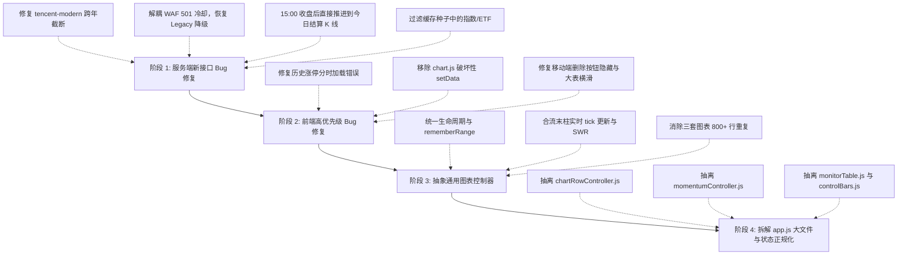

# 2026-09-03 项目代码审查、Bug 诊断与架构重构 Handoff

## 1. 审查元数据与工作树基线

- **审查日期**：2026-09-03
- **审查分支**：`main`
- **基线提交**：`18f173f Fix live charts and momentum scan recovery`
- **审查范围**：
  - 前端全量核心代码：`src/js/app.js` (3,856 行), `src/js/api.js`, `src/js/chart.js`, `src/js/kline.js`, `src/js/limitUpView.js`, `src/js/aktoolsApi.js`, `src/js/time.js`, `src/js/marketSession.js` 等
  - 样式与排版：`src/style.css` (1,254 行) 与移动端媒体查询
  - 服务端与共享缓存：`server/` 共享缓存与反向代理、后台调度任务、以及**开发者最新针对 4,015 只失败修复所提交的代码** (`klineService.js`, `marketData.js`, `momentumService.js`, `spotService.js`)
  - 需求与历史设计对照：`SPEC.md`, `STATUS.md`, `AGENTS.md`, 历史阶段 handoff 文档
- **自动化测试现状**：
  - `npm run lint`：通过（0 错误 0 警告）
  - `npm test`：通过（569 / 569 单测全部通过）
  - `npm run e2e`：通过（51 / 51 E2E 全部通过）
  - `npm run build`：通过（生产构建成功）

---

## 2. 审查结论摘要

当前版本经过前几个阶段的打磨，基础设施与测试安全网非常扎实（无外部框架、无 ECharts、轻量快速、SWR 缓存健全、单测覆盖全）。
开发者最新针对“4,015 只股票日 K 刷新失败”的改动方向非常敏锐，成功修复了三个根本问题（盘中上游日 K 未收盘、快照目录脏数据、旧端点易 501）。

但通过全盘细致审查，项目中不仅遗留了大量早期快速打补丁积累的**“屎山代码/Copy-Paste”**和**界面交互硬伤**，而且**在开发者刚刚提交的新代码中，又引入了 2 个阻断级逻辑死锁/截断 Bug 以及多处时序与数据纯度隐患**：

1. **开发者最新提交引入的隐蔽 Bug (P0/P1)**：
   - **`tencent-modern` 单年查询跨年截断 Bug**：`buildTencentYearKlineUrl` 硬编码为当年 `01-01` 至 `12-31`。每年 1 月份只有极少柱子（<11 根），将直接导致全市场 10 日涨幅在年初大面积崩溃。
   - **WAF 501 提前熔断 Legacy Tencent 降级**：`proxy.finance.qq.com` (modern) 报 501 后立即设置 5 分钟冷却，导致紧随其后的 `web.ifzq.gtimg.cn` (legacy) 兜底在首行被 `waitForTencentSlot()` 直接拦截抛错，兜底机制完全瘫痪。
   - **15:00 收盘后仍强行按“未完结盘中”由快照合成**：收盘后当天的官方完整日 K 已经清算发布，但扫描日期决策函数仍强制回退到昨天并合成今日柱，阻碍了今天日 K 正常持久化沉淀到缓存中。
   - **本地缓存全集混入指数与 ETF**：快照 fallback 从本地目录读取代码时仅排除了 `bj81`，导致上证指数 `sh000001`、深证成指 `sz399001`、沪深300ETF 等非股票被混入全市场个股 10 日涨幅池。
2. **核心业务需求对齐缺陷 (P0/P1)**：
   - **历史涨停分时图加载了“今天”而非“历史所选日”**：用户在涨停看板切换到历史日期（如 `2026-05-15`）展开个股图表，分时图默认拉取的是今天的走势，而非看板所选历史交易日，失去历史回溯价值。
   - **期货图表无实现且无降级提示**：需求承诺支持期货走势图，但目前代码中只有股票图表数据源。用户点击期货行直接报红色未捕获网络错误；且输入框无法自动识别无 `nf` 前缀的期货代码。
3. **破坏性 Fallback 与小屏交互体验缺陷 (P0/P1)**：
   - `chart.js` 中实时 tick 更新异常时的 catch 块调用了 `candleSeries.setData([bar])`，一旦触发会将用户已加载的数百根历史 K 线**清空为仅存 1 根**！
   - CSS 媒体查询 (`nth-child(n+8)`) 隐藏了监控表第 10 列的操作按钮，导致**手机端用户无法在行内删除股票**。
   - 涨停看板 13 列数据在手机端既不隐藏次要列，也没有横向滚动容器，排版挤压破损。
4. **本该模块化却硬写入的屎山代码（三倍 Copy-Paste）**：
   - `src/js/app.js` 膨胀至 **3,856 行**。
   - 监控页、涨停页、10日涨幅页三处展开内联图表，将挂载、周期切换、K线/分时加载、十字线联动、状态更新等逻辑**整段复制粘贴了 3 遍**，重复代码超 **800 行**！
   - **拷贝导致的遗留 Bug**：监控页和涨停页补齐了实时 Tick 末柱更新与 SWR 缓存联动，但**完全遗漏了 10 日涨幅页**，导致 10 日涨幅页图表在盘中价格刷新时末点完全静止、SWR 刷新后图表也不联动。

---

## 3. 详细缺陷清单与代码证据

### P0-1【已修复】：`tencent-modern` 单年查询跨年截断 Bug（每年 1 月将导致 10 日涨幅大面积失效）

> **状态（2026-09-03）**：已改为请求上一年 01-01 至当年 12-31，并实测返回 640 根；对应构造与解析测试已通过。

- **代码位置**：[`server/klineService.js:108-109`](file:///d:/AiPrograms/project1/server/klineService.js#L108-L109)、[`src/js/kline.js:203-216`](file:///d:/AiPrograms/project1/src/js/kline.js#L203-L216)
- **代码证据**：
  ```javascript
  // src/js/kline.js:212
  url.searchParams.set('param', `${norm},day,${safeYear}-01-01,${safeYear}-12-31,640,qfq`);
  ```
- **根因分析**：
  `buildTencentYearKlineUrl` 硬编码了仅请求当年 `01-01` 至 `12-31` 的日 K 线。到了每年 1 月份（例如 1 月 2 日 ~ 1 月 15 日），当年实际发生的交易日只有 1~8 天，腾讯返回的数组长度只有 1~8 根。
  而在 [`hasMomentumKlineCoverage`](file:///d:/AiPrograms/project1/server/klineService.js#L180) 中要求：`if (usable.length < 11) return false;`，10 日涨幅计算也需要至少 11 根柱子。
- **影响**：每年 1 月份如果东财限流切换至腾讯现代端点，全市场股票将因为不足 11 根柱子全部被判为刷新失败，10 日涨幅功能完全瘫痪；前端用户点开 K 线图也会丢失上一年历史走势。
- **修复方案**：
  在年初时段（当前年份柱子 < 60 根）跨年拼接前一年数据（合并请求 `${safeYear - 1}` 的日 K 并去重），或在不足 11 根时自动回退到 Legacy 接口。

---

### P0-2【已修复】：WAF 501 提前熔断 Legacy Tencent 降级链路（逻辑死锁 Bug）

> **状态（2026-09-03）**：modern 与 legacy 已拆分独立冷却状态，modern 501 不再阻断 legacy 请求。

- **代码位置**：[`server/klineService.js:126-136`](file:///d:/AiPrograms/project1/server/klineService.js#L126-L136)
- **代码证据**：
  ```javascript
  // 1. 如果 modern 端点返回 501，立即设置全局冷却
  if (modernError && /HTTP 501/.test(modernError.message || '')) {
    tencentDisabledUntil = Math.max(tencentDisabledUntil, Date.now() + TENCENT_WAF_COOLDOWN_MS);
  }

  // 2. 紧接着降级到 legacy 端点：
  const txUrl = toAbsoluteTencentUrl(buildTencentKlineUrl(code, { period }));
  if (!txUrl) throw new Error('No available kline upstream');
  for (let attempt = 0; attempt < 2; attempt++) {
    await waitForTencentSlot(); // <--- 这里立即检查 tencentDisabledUntil 并抛出异常！
  ```
- **根因分析**：
  `proxy.finance.qq.com` (modern) 与 `web.ifzq.gtimg.cn` (legacy) 是不同域名与机房。Modern 端点发生 501 时设置了 `tencentDisabledUntil`，导致紧随其后的 Legacy 端点在调用 `waitForTencentSlot()` 时直接命中冷却拦截，抛出 `Tencent kline temporarily blocked by WAF`。
- **影响**：Legacy 端点作为备用兜底的代码完全成了一个死分支，一旦 Modern 501，Legacy 永远无法得到执行。
- **修复方案**：
  拆分 Modern 与 Legacy 冷却状态（如 `tencentModernDisabledUntil` 与 `tencentLegacyDisabledUntil`），或者在 Legacy 也尝试失败后才设置统一冷却。

---

### P0-3：历史涨停看板展开分时图加载了“今天”而非“历史所选日”

- **代码位置**：[`src/js/app.js:2731-2734`](file:///d:/AiPrograms/project1/src/js/app.js#L2731-L2734)
- **代码证据**：
  ```javascript
  // app.js:2731
  if (!inst.selectedTradeDate) inst.selectedTradeDate = getLastKlineDate(data.items);
  inst.loading = false;
  applyLimitUpKlineToChart(code, data);
  loadLimitUpIntraday(code, inst.selectedTradeDate);
  ```
- **根因分析**：
  用户在看板选择了历史日期 `state.limitUp.selectedDate`（例如 `2026-06-01`）。当点击展开某只涨停股时，`loadLimitUpKline` 获取全量日 K 线，`getLastKlineDate(data.items)` 获取的是该股票在整个数据集里的最后一天（即最新日期/今天）。代码没有优先使用 `state.limitUp.selectedDate`，导致分时图直接以今天为基准去请求分时数据。
- **影响**：看历史涨停板的用户永远看不到当天的分时拉板轨迹，如果今天该股停牌或非交易日还会直接显示分时报错。
- **修复方案**：
  ```javascript
  if (!inst.selectedTradeDate) {
    inst.selectedTradeDate = state.limitUp.selectedDate || getLastKlineDate(data.items);
  }
  ```

---

### P0-4：`chart.js` 的 `updateKline` / `updateVolume` 存在灾难性清空 Fallback

- **代码位置**：[`src/js/chart.js:228-248`](file:///d:/AiPrograms/project1/src/js/chart.js#L228-L248)
- **代码证据**：
  ```javascript
  function updateKline(bar) {
    if (!bar) return;
    try {
      candleSeries.update(bar);
    } catch {
      candleSeries.setData([bar]); // <--- 毁灭性清空
    }
  }
  function updateVolume(bar) {
    if (!bar) return;
    try {
      volumeSeries.update(bar);
    } catch {
      volumeSeries.setData([bar]); // <--- 毁灭性清空
    }
  }
  ```
- **根因分析**：
  TradingView Lightweight Charts 的 `series.update()` 在收到异常时间戳（如非递增）或特定脏数据时会抛出异常。正常防御策略应为捕获后忽略该异常 tick 或触发异步完整刷新；而现代码却在 catch 中调用 `setData([bar])`，直接用当前单根柱子覆盖替换了此前加载的全部数百根柱子。
- **影响**：一旦偶发一次不合规报价，用户正在查看的完整 K 线图直接被清空成只有单柱。
- **修复方案**：
  移除 catch 中的 `setData([bar])`，改为安全警告并保持现有 K 线不变（如同模块内的 `updateMA` line 256 那样忽略）。

---

### P1-1【已修复】：盘后扫描判定不严：15:00 以后依然当成“未完结盘中”强制由快照合成

> **状态（2026-09-03）**：盘后任务改为 15:05；北京时间 15:05 后 `historyTargetDate` 为当日且不再合成 live bar，已有确定性单测。

- **代码位置**：[`server/momentumService.js:43-56`](file:///d:/AiPrograms/project1/server/momentumService.js#L43-L56)
- **根因分析**：
  `resolveMomentumScanDates` 中仅判断了 `dateKey === todayKey && marketDate === todayKey`，完全没有判断当前时间是否已过 15:00 收盘时间。
  每天 15:00 以后（尤其是 15:01 的盘后自动扫描任务），当天的官方完整日 K 线已经在东财/腾讯结算发布。但逻辑依然将 `historyTargetDate` 退回到昨天，强制把今天作为 `liveDate` 由快照去合成。
- **影响**：盘后和夜间生成的日 K 缓存文件永远停留在昨天，阻碍了今天官方完整的收盘 K 线沉淀到本地缓存中。
- **修复方案**：
  若当前北京时间在 15:05 之后且 `dateKey === todayKey`，应当将 `historyTargetDate` 直接设为今天，`liveDate` 置空，优先拉取官方完整结算日 K。

---

### P1-2【已修复】：缓存目录作为股票候选池时，缺少纯 A 股代码过滤（混入指数/ETF）

> **状态（2026-09-03）**：已加入沪深北纯个股号段白名单，排除指数、ETF、转债，并覆盖 `sz302xxx` 新号段测试。

- **代码位置**：[`server/spotService.js:8-17`](file:///d:/AiPrograms/project1/server/spotService.js#L8-L17)、[`server/marketData.js:127-133`](file:///d:/AiPrograms/project1/server/marketData.js#L127-L133)
- **根因分析**：
  `getKlineCacheUniverse` 直接通过 `/^(sh|sz|bj)\d{6}$/i` 读取 `data/cache/kline` 目录。若用户自选列表中包含上证指数 `sh000001`、深证成指 `sz399001`、创业板指 `sz399006` 或各类 ETF 基金 `sh510300`，在 AKTools 故障回退时，`fetchTencentSpot` 仅过滤了 `bj81`，导致指数和基金被混入全市场 A 股个股 10 日涨幅候选池。
- **修复方案**：
  在候选过滤中增加 A 股纯个股号段白名单校验（沪主板 `600/601/603/605`、科创板 `688/689`、深主板 `000/001/002/003`、创业板 `300/301`、北交所 `83/87/88/92/43`），彻底排除指数与基金。

---

### P1-3：移动端 (≤768px) 监控表格“删除”列被完全隐藏

- **代码位置**：[`src/style.css:901-903`](file:///d:/AiPrograms/project1/src/style.css#L901-L903)
- **代码证据**：
  ```css
  @media (max-width: 768px) {
    .watch-table th:nth-child(n+8), .watch-table td:nth-child(n+8) { display: none; }
  }
  ```
- **根因分析**：
  监控表第 10 列是操作列（含“删除”按钮）。`nth-child(n+8)` 将第 8 列量比、第 9 列成交额、以及第 10 列操作一并隐藏。
- **影响**：移动端用户无法在表格行内删除单只自选股。
- **修复方案**：
  精确隐藏第 7、8、9 列（开盘、量比、成交额），显式保留第 10 列（`.col-op`）。

---

### P1-4：图表控制器逻辑三倍 Copy-Paste 与 10 日涨幅图表遗留 Bug

- **代码位置**：
  - 监控页图表：[`src/js/app.js:3290-3500`](file:///d:/AiPrograms/project1/src/js/app.js#L3290-L3500)
  - 涨停页图表：[`src/js/app.js:2547-2715`](file:///d:/AiPrograms/project1/src/js/app.js#L2547-L2715)
  - 10日涨幅图表：[`src/js/app.js:1450-1520`](file:///d:/AiPrograms/project1/src/js/app.js#L1450-L1520)
- **代码重合度**：存在 **800+ 行逐行重复代码**，仅前缀和状态字典不同。
- **拷贝产生的隐蔽 Bug**：
  - **遗漏实时行情更新**：在 `updateChartLastTickMulti()` 中，只循环了 `state.expandedCodes` 和 `state.limitUp.expandedCodes`，**漏掉了 `state.momentum.expandedCodes`**！导致 10 日涨幅页展开的图表在行情刷新时不更新末柱 OHLCV。
  - **遗漏 SWR 缓存联动**：在 `_onKlineUpdated()` 中，只通知了监控页和涨停页，**漏掉了 10 日涨幅页**，导致后台缓存更新后 10 日涨幅图表仍显示旧数据。
- **重构方案**：
  抽象统一的 `InlineChartRowManager`，三处表格统一调用相同控制器。

---

### P1-5：期货图表未实现且缺乏优雅降级提示

- **代码位置**：[`src/js/kline.js:51-53`](file:///d:/AiPrograms/project1/src/js/kline.js#L51-L53)、[`src/js/api.js:424-427`](file:///d:/AiPrograms/project1/src/js/api.js#L424-L427)、[`src/js/app.js:237`](file:///d:/AiPrograms/project1/src/js/app.js#L237)
- **现象分析**：
  - 输入框添加代码时，期货代码不带 `nf`（如 `rb2505`）直接被报错“未识别到有效代码”。
  - 用户手动输入 `nfRB2505` 成功添加后，点击行展开图表，`fetchKline` 返回 `null`，界面显示大红字 `错误: 未能获取 K 线数据`。
- **修复方案**：
  - 输入解析层支持国内常见商品期货/股指期货代码自动补全 `nf`。
  - 图表层检测到 `quote.type === 'future'` 时，若未接入期货 K 线源，状态栏明确展示“暂不支持期货走势图（仅支持实时行情与语音提醒）”，避免误报网络错误。

---

### P2-1【已修复】：时区混用 `getUTCFullYear()` 导致跨年夜时区漂移

> **状态（2026-09-03）**：腾讯日 K 请求年份已统一取北京时间日期年份。

- **代码位置**：[`server/klineService.js:108`](file:///d:/AiPrograms/project1/server/klineService.js#L108)
- **根因分析**：使用了 `new Date().getUTCFullYear()`，在跨年夜北京时间 00:00~08:00 会错误拉取去年的日 K。
- **修复方案**：统一使用北京时间年份。

---

### P2-2：交易日历数据反向挂在 `state.limitUp` 导致架构倒置

- **代码位置**：[`src/js/app.js:2988, 2997, 3002`](file:///d:/AiPrograms/project1/src/js/app.js#L2988)
- **根因分析**：监控页语音时段和自动刷新调度跨模块硬编码读取 `state.limitUp.tradingDates`。
- **修复方案**：提升至根状态 `state.tradingDates`，全局统一共享。

---

### P2-3：路由切换至涨停页时，监控页定时器仍在空转 DOM 更新

- **代码位置**：[`src/js/app.js:3821-3845`](file:///d:/AiPrograms/project1/src/js/app.js#L3821-L3845)
- **根因分析**：切到 `#/limit-up` 时监控页 DOM 被清除，但监控页 `state.timer` 未清除，每 10 秒仍在对脱离 DOM 树的旧节点空转重绘与计算。
- **修复方案**：进入 `#/limit-up` 时调用 `stopMonitorTimer()`。

---

### P2-4：前端 API 请求层缺少统一的超时保护 (Timeout)

- **代码位置**：[`src/js/api.js:78-87`](file:///d:/AiPrograms/project1/src/js/api.js#L78-L87)、[`src/js/aktoolsApi.js:126`](file:///d:/AiPrograms/project1/src/js/aktoolsApi.js#L126)
- **修复方案**：前端封装 `fetchWithTimeout(url, opts, timeoutMs = 8000)`，防止浏览器原生 `fetch` 在异常网络下无限挂起。

---

## 4. 架构重构与改造落地路线 (Refactoring Roadmap)

### 模块解耦与拆分目标

```
src/js/
├── main.js
├── app.js                          # 瘦身为主入口调度器 (~600 行)
├── state.js                        # [NEW] 核心响应式状态机与 Action
├── controllers/
│   ├── chartRowController.js       # [NEW] 通用行内图表管理器 (消灭 800+ 行重复)
│   └── momentumController.js       # [NEW] 10日涨幅扫描与表格管理
├── views/
│   ├── monitorTable.js             # [NEW] 监控列表 DOM 与行操作
│   ├── controlBars.js              # [NEW] 语音控制条与价格预警控制条
│   └── limitUpView.js              # (保持，对接通用图表控制器)
└── ... (其他已纯函数化的 api.js, kline.js 等保持)
```

### 分阶段实施步骤



- **阶段 1 (服务端关键逻辑修复)**：
  1. `buildTencentYearKlineUrl` 支持跨年前后拼接，确保年初 1 月份获取足够 K 线。
  2. 拆分 Modern 与 Legacy 冷却，确保 501 发生时能顺利兜底到 Legacy。
  3. `resolveMomentumScanDates` 增加 15:05 收盘后判定，盘后直接更新今天官方日 K。
  4. `fetchTencentSpot` 增加纯 A 股号段正则过滤。
- **阶段 2 (前端 P0/P1 Bug 修复)**：
  1. 修复 `loadLimitUpKline` 中 `selectedTradeDate` 优先取 `state.limitUp.selectedDate`。
  2. 修复 `chart.js` 中 `updateKline`/`updateVolume` 的 catch，移除 `setData([bar])`。
  3. 修复 `style.css` 移动端选择器，确保删除按钮 `.col-op` 始终可见；为 `.lu-table` 增加响应式横向滚动包装。
  4. 涨停看板行点击加入 `.lu-check` 和 `.lu-pin` 容器防误触。
- **阶段 3 (通用图表控制器抽象)**：
  1. 创建 `src/js/controllers/chartRowController.js`，统一处理 `openChart`、`closeChart`、`changePeriod`、`mountChart`、`applyKline`、`applyIntraday`、`updateTick`、`onKlineUpdated`。
  2. 监控页、涨停页、10 日涨幅页统一调用该控制器，消除 800+ 行重复代码。
  3. 自动补齐 10 日涨幅图表的实时 Tick 刷新与 SWR 联动。
- **阶段 4 (`app.js` 瘦身与状态正规化)**：
  1. 交易日历提升为根状态 `state.tradingDates`。
  2. 路由切换到 `#/limit-up` 时暂停监控页 DOM patch。
  3. 抽离监控表格视图和设置条组件。

---

## 5. 验证与防护基线

每次修改必须执行：
1. `npm run lint`：保持 0 报错 0 警告；
2. `npm test`：569 个单元测试全量回归通过；继续为“历史日期分时初始化”、“移动端删除列可见性”、“10日涨幅图表实时 tick”补充自动化用例；
3. `npm run e2e`：51 个 Playwright 测试全量通过；
4. `npm run build`：验证产物打包正常。

---

## 6. 本轮 4,015 刷新失败修复后的审查闭环

本 handoff 写作期间发现的服务端边界项已在同一修复批次内处理：

- 腾讯 modern 日线请求改为跨上年到当年，实测仍返回 640 根（2024-01-11 至 2026-09-02），不再依赖单年一月份是否足够 11 根。
- modern 与 legacy 使用独立 WAF 冷却状态；modern 的 501 不再在 legacy 发请求前把它拦截。
- 盘后自动扫描从 15:01 调整至 15:05；北京时间 15:05 后直接要求官方当日日 K，不再合成未完结柱。
- 腾讯快照种子新增纯 A 股号段白名单，排除指数、ETF 和北交所转债，并保留新出现的 `sz302xxx` 个股号段。
- 北京时间年份已替代 UTC 年份；Windows `EPERM/EACCES/EBUSY` 缓存原子替换增加退避重试，页面二次点击扫描终验无错误。

本 handoff 中历史涨停分时日期、K 线破坏性 fallback、移动端操作列、10 日涨幅内联图表实时联动和 `app.js` 模块化等前端问题仍是下一批工作，不在本次“4,015 只刷新失败”修复范围内。
