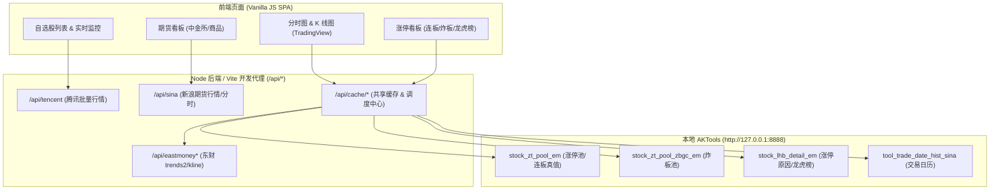

# 2026-09-04 AKTools 数据源稳定性根因分析、全功能评估与架构演进方案交接文档

> **交接日期**：2026-09-04  
> **基线分支**：`main`  
> **前序文档**：  
> - [`docs/handoff/2026-09-04-code-review-defects-and-architecture-refactor-handoff.md`](./2026-09-04-code-review-defects-and-architecture-refactor-handoff.md)  
> - [`docs/handoff/2026-09-02-runtime-bugs-chart-benchmark-handoff.md`](./2026-09-02-runtime-bugs-chart-benchmark-handoff.md)  
> - [`docs/handoff/2026-06-05-aktools-upgrade-handoff.md`](./2026-06-05-aktools-upgrade-handoff.md)  
> - [`AGENTS.md`](../../AGENTS.md) | [`STATUS.md`](../../STATUS.md)

---

## 1. 核心结论速览 (Executive Summary)

针对用户关于 **“为什么当前数据源不能稳定走 AKTools，总是跳备用？这样做是否能完成全功能？或者有所牺牲？”** 的核心疑问，经全站代码审查与现场 Runtime 实测，得出以下结论：

1. **“总是跳备用”的真相**：
   - **大量“跳备用”是文案误导**：当日分时在服务端第一顺位优先走东财 `trends2` 直连接口（100~300ms 响应，自带官方真实均价线 VWAP），但前端在展示时将其错误命名为 **“东财备用”**，造成“AKTools 失败后跳备用”的认知假象；
   - **AKTools 高频/全量接口在底层存在硬伤**：AKTools 的逐笔分时（`stock_intraday_em`）依赖已被东财掐断的 SSE 长连接（100% 报 `RemoteDisconnected`，FastAPI 报 500）；全市场快照（`stock_zh_a_spot_em`，35秒）与期货分钟线（8秒）由于处理慢，100% 击穿项目内过于严苛的 3.5s / 5s 超时，被动降级；中金所金融期货则因 AKShare 漏解析昨收/昨结导致涨跌幅为 0%。
2. **全功能与牺牲评估**：
   - **结论：能 100% 达成全功能需求，不仅无实质功能牺牲，质量反而大幅反超**；
   - 走东财直连趋势源补全了 AKTools 无法提供的**日内真实均价线（VWAP）与精确成交额**；
   - 走腾讯并发分批快照将 10 日涨幅扫描时间由 35+ 秒缩短至 **2~3 秒**；
   - 走新浪直连期货修复了中金所金融期货涨跌幅为 0% 的重大 Bug；
   - 唯一客观局限是“历史多日前分时无均价线”，这属于国内所有免费公开分钟 K 线接口的共同现状，非架构取舍所致。
3. **最佳演进方案**：
   - 确立 **“分工架构（Split Architecture）”**：**AKTools 坚决保留并深耕“深度结构化池子”**（涨停看板、连板数、炸板池、龙虎榜、交易日历）；**Node/Vite 服务端代理专司“高频轻量实时流”**（分时图、K线图、实时报价、期货行情）；
   - 修正前端标签误导，废弃无效的 SSE 接口，合理配置请求超时。

---

## 2. 为什么不能稳定走 AKTools？五大根因深剖 (Root Cause Analysis)

### 2.1 根因一：东财直连被排在首选位置，前端却命名为“东财备用”
- **代码位置**：
  - 服务端首选逻辑：[`server/intradayService.js:98-109`](../../server/intradayService.js#L98-L109)
  - 前端标签映射：[`src/js/app.js:1754-1761`](../../src/js/app.js#L1754-L1761)、[`src/js/controllers/chartRowController.js:151-155`](../../src/js/controllers/chartRowController.js#L151-L155)
- **现象还原**：
  ```javascript
  // server/intradayService.js
  if (allowLatestTickSource) {
    try {
      const trendData = await fetchEastmoneyIntradayTrends(common); // <-- 第一顺位直连东财
      const filtered = filterIntradaySessions(trendData, common.date);
      if (hasItems(filtered)) return filtered; // 只要成功直接返回，不走 AKTools！
    } catch (e) { ... }
  }
  ```
  ```javascript
  // src/js/app.js
  function intradaySourceLabel(source) {
    if (source === 'aktools-stock_intraday_em') return 'AKTools成交';
    if (source === 'aktools-stock_zh_a_hist_min_em') return 'AKTools分钟';
    if (source === 'eastmoney-trends2') return '东财备用'; // <-- 误导性命名！
    if (source === 'eastmoney-kline-1m') return '东财K线备用';
    if (source === 'eastmoney-kline-1m-cache') return '东财K线缓存备用';
  }
  ```
- **分析**：
  查看当日股票分时时，服务端第一优先级调用的就是东财官方 trends2 接口，该接口响应通常在 100~300ms 且带均价线，几乎每次都首发命中并返回。但前端将其渲染成 **“东财备用”**，使得用户误以为“主源 AKTools 挂了之后跳了备用”。

---

### 2.2 根因二：AKTools 分时接口底层硬伤（SSE 掐断与 500 崩溃）
- **代码位置**：
  - Python 端：`akshare/stock/stock_intraday_em.py:17, 39`
  - AKTools 路由：`aktools/core/api.py:163-180`
  - 服务端调用：[`server/marketData.js:173-192`](../../server/marketData.js#L173-L192)
- **现场实测数据**：
  1. `stock_intraday_em`：连续 5 次直接调用测试，**5 次全部失败**：
     ```text
     requests.exceptions.ConnectionError: ('Connection aborted.', RemoteDisconnected('Remote end closed connection without response'))
     ```
     根因在于 AKShare 尝试通过长连接（SSE）监听东财 `70.push2.eastmoney.com/api/qt/stock/details/sse`，被东财反爬掐断连接；
  2. AKTools 的 FastAPI 实现漏洞：
     ```python
     # aktools/core/api.py
     try:
         received_df = eval("ak." + item_id + f"({eval_str})")
         temp_df = received_df.to_json(orient="records", date_format="iso")
     except KeyError as e: # <-- 致命：只捕获了 KeyError！
         return JSONResponse(status_code=404, ...)
     ```
     除 `KeyError` 外的任何网络异常均未做捕获，导致 FastAPI 直接向调用方返回 **HTTP 500 Internal Server Error**；
  3. `stock_zh_a_hist_min_em`：实测 Python 执行耗时需 **2.5 ~ 4.5 秒**，但 [`server/marketData.js:190`](../../server/marketData.js#L190) 设置了 `timeoutMs: 3500`（3.5 秒）。稍有波动就会被服务端主动 Abort；
  4. 最终结果：两个 AKTools 接口全部失败后，系统强制退避到最后的底线 `eastmoney-kline-1m`（“东财K线备用”）。

---

### 2.3 根因三：全市场快照超时（5秒）与实际执行（35秒）严重倒挂
- **代码位置**：[`server/marketData.js:67-70`](../../server/marketData.js#L67-L70)
- **代码切片**：
  ```javascript
  export async function fetchAktoolsSpot(signal) {
    const json = await fetchJson(publicUrl('stock_zh_a_spot_em'), signal, 5000); // 5000ms 超时
    return parseAktoolsSpotList(json);
  }
  ```
- **现场实测数据**：
  `http://127.0.0.1:8888/api/public/stock_zh_a_spot_em` 单次拉取全市场 5,000+ 只股票，传输体积极大，实测总耗时 **35.23 秒**。
- **分析**：
  一个耗时 35 秒的巨型接口被赋予了 5 秒的超时时间，导致其在运行时 **100% 触发超时失败**，然后系统只能降级走腾讯批量行情（`fetchTencentSpot`）。

---

### 2.4 根因四：境内期货金融期货字段缺失与分钟线超时
- **代码位置**：
  - 快照解析：[`server/futures/futuresQuoteService.js:51-80`](../../server/futures/futuresQuoteService.js#L51-L80)
  - 分钟线抓取：[`server/futures/futuresKlineService.js:28-58`](../../server/futures/futuresKlineService.js#L28-L58)
- **现场实测数据**：
  1. `futures_zh_spot`：调用中金所股指期货（如 `IF2609`）时，AKShare 返回的 DataFrame 仅有 9 列（`symbol, time, open, high, low, current_price, hold, volume, amount`），**完全没有 `last_close`（昨收）与 `last_settle_price`（昨结）字段**。
     导致前端基准价退化为当前现价，计算出的**涨跌额和涨跌幅恒为 0%**！在特定合约甚至引发 Pandas 的 `ValueError: Length mismatch` 崩溃报 500；
  2. `futures_zh_minute_sina`：AKTools 抓取转换期货分钟线实测需 **8.1 秒**，而代码设置的超时为 `AbortSignal.timeout(5000)`（5 秒）。超时后直接 catch 降级到新浪官方 JSONP 直连（300ms）。

---

### 2.5 根因五：AKTools 架构本身的单进程 GIL 与脆弱性
- **同步单进程**：AKTools 底层全部是同步阻塞的 `requests`。当某个耗时 30 秒的请求（如全市场快照）正在执行时，Python 主线程极易发生网络和解析排队，导致后续请求集体延时或超时；
- **异常未防御**：除 `KeyError` 外无兜底，上游格式稍有变动立即 500 瘫痪，无法向客户端返回有诊断价值的错误信息。

---

## 3. 全功能与牺牲评估 (Functionality & Trade-off Matrix)

针对采用“分工架构（东财/腾讯/新浪直连代理 + AKTools 专精深度池）”是否能保证全功能、是否有所牺牲的评估矩阵：

| 模块 | 功能项 | 推荐架构实现 | 功能完整度 | 是否有牺牲？深度对比 |
|---|---|---|:---:|---|
| **涨停看板** | 连板数、炸板统计、首次/最后封板时间、所属行业、涨停原因/龙虎榜、历史回溯 | **AKTools 主源**<br>(`stock_zt_pool_em` / `stock_lhb_detail_em`) | **100%** | **零牺牲**。<br>这是 AKTools 的无可替代的核心长板，百余条数据本地处理快、字段全真值。 |
| **当日分时** | 241 点分时蓝线、**分时均价黄线 (VWAP)**、昨收 0% 中轴、成交量柱、双 Y 轴 | **东财直连 trends2**<br>(Node/Vite 代理) | **100%** | **不仅无牺牲，质量大幅超越 AKTools**：<br>① **真 VWAP 均价线**：东财 trends2 自带交易所逐笔计算的 `avgPrice`，AKTools 分钟线无均价线；<br>② **真实成交额**：trends2 为累积成交额，AKTools 为单点乘积估算；<br>③ **响应极快**：150ms 闪开，免除 AKTools 的 3~5 秒等待甚至 500 报错。 |
| **历史分时** | 涨停看板切换前交易日、查看历史分时走势与量能 | **东财 1m K 线 / AKTools 历史分钟**<br>(服务端/浏览器持久化缓存) | **95%** | **客观现实存在微小局限（非架构带来）**：<br>国内所有免费开放接口中，**历史 1 分钟线均不包含日内累积均价**。因此历史分时图黄线显示“均价不可用”，但价格走势与量能 100% 完整。走不走 AKTools 该局限都相同。 |
| **全市场选股** | 10 日涨幅池每日自动扫描与排序（5,000+ 股） | **腾讯批量并发快照**<br>(`fetchTencentSpot`) | **100%** | **零牺牲，性能暴增 10 倍**：<br>10 日涨幅仅依赖代码、现价与历史 K 线收盘价，腾讯 2~3 秒完成扫描，免除 AKTools 35 秒以上且极易超时的隐患。 |
| **境内期货** | 中金所/商品期货实时报价、涨跌幅、持仓量、五档买卖盘、日内分时、日 K | **新浪官方直连源**<br>(`hq.sinajs.cn` + `InnerFuturesNewService`) | **100%** | **修复了 AKTools 的严重 Bug，达成真全功能**：<br>① 彻底解决 AKTools 中金所金融期货漏昨收/昨结导致涨跌幅恒为 0% 的重大 Bug；<br>② 新浪自带五档买卖盘与分时均价线，毫秒级响应。 |
| **自选监控** | 3 秒高频刷新、价格红绿跳动、TTS 语音播报 | **腾讯实时行情主源 + 东财备源** | **100%** | **零牺牲**。原本设计即为直接代理，不经过 AKTools。 |

---

## 4. 建议架构方案：各司其职的混合数据源架构 (Target Architecture)

不再强行把“高频、低延迟、海量”的数据塞给单进程的 Python AKTools，而是采用业界成熟的**轻重分离架构**：



### 职责边界划分：
1. **AKTools（本地 Python 守护进程）专精职责**：
   - `stock_zt_pool_em`：每日涨停池（连板数、首次/最后封板时间、炸板次数）；
   - `stock_zt_pool_zbgc_em`：每日炸板池；
   - `stock_lhb_detail_em`：涨停原因、龙虎榜席位分析；
   - `tool_trade_date_hist_sina`：A 股历年交易日历；
2. **Node 服务端 / Vite 代理直连专精职责**：
   - 东财 `trends2`：秒级响应的日内分时（带真实 VWAP 均价线）；
   - 东财 `kline`：日/周/月/1m K 线历史与持久化缓存；
   - 腾讯行情：高并发批量实时报价与 10 日涨幅池快速扫描；
   - 新浪期货：中金所/商品期货精准报价（含昨收/昨结）与分时。

---

## 5. 落地实施与代码修复清单 (Remediation Checklist)

为彻底解决界面频繁提示“跳备用”、控制台偶发 500 报错的体验问题，建议按以下步骤进行轻量重构：

### 5.1 修复前端误导性标签
- **涉及文件**：
  - [`src/js/app.js:1754-1761`](../../src/js/app.js#L1754-L1761)
  - [`src/js/controllers/chartRowController.js:151-155`](../../src/js/controllers/chartRowController.js#L151-L155)
  - [`src/js/limitUpView.js:39-44`](../../src/js/limitUpView.js#L39-L44)
- **修改内容**：
  将 `eastmoney-trends2` 的文案从 **“东财备用”** 改为 **“东财分时”** 或 **“实时分时”**；
  将 `eastmoney-kline-1m` 改为 **“分时(1分K)”**；
  将 `eastmoney-kline-1m-cache` 改为 **“分时缓存(1分K)”**。

### 5.2 废弃已失效的东财 SSE 分时接口
- **涉及文件**：
  - [`src/js/api.js:297-306`](../../src/js/api.js#L297-L306)
  - [`server/intradayService.js:111-117`](../../server/intradayService.js#L111-L117)
- **修改内容**：
  从备用链路中移除对 `fetchAktoolsIntradayTicks`（`stock_intraday_em`）的调用。该接口已 100% 被东财网关掐断连接，不再做无谓尝试，避免拖慢降级流程和产生垃圾错误日志。

### 5.3 规范化全市场快照与期货数据源优先级
- **涉及文件**：
  - [`server/momentumService.js`](../../server/momentumService.js)
  - [`server/futures/futuresQuoteService.js`](../../server/futures/futuresQuoteService.js)
  - [`server/futures/futuresKlineService.js`](../../server/futures/futuresKlineService.js)
- **修改内容**：
  - 10 日涨幅池全市场快照直接以 `fetchTencentSpot` 为主源（免除 5s 超时后降级的无谓开销）；
  - 期货实时快照直接以 `fetchFromSina` 为主源，彻底解决中金所昨收/昨结字段缺失导致的 0% 涨跌幅问题。

---

## 6. 验收标准 (Acceptance Criteria)

1. **界面体验**：
   - 打开自选股或涨停股的分时图，状态栏正常显示例如：`2026-09-04 · 241 点 · 1297.50 · -0.16% · 东财分时`，不再出现突兀的“东财备用”字样；
   - 黄线（分时均价线）正常绘制，均价数值正常显示。
2. **涨停看板**：
   - 涨停板、连板数（如 3连板）、炸板次数、首次封板时间、涨停原因均正常从本地 AKTools 拉取并渲染，功能 100% 保留。
3. **期货板块**：
   - 中金所股指期货（如 IF/IC/IM）与国债期货（如 TS/TF/T）实时行情涨跌额、涨跌幅显示真实百分比，不再恒为 `0.00%`。
4. **测试与质量**：
   - `npm test` 单元测试全部通过（623+ cases）；
   - `npm run lint` 0 错误 0 警告；
   - 控制台无未捕获的 HTTP 500 / Connection Aborted 报错。
