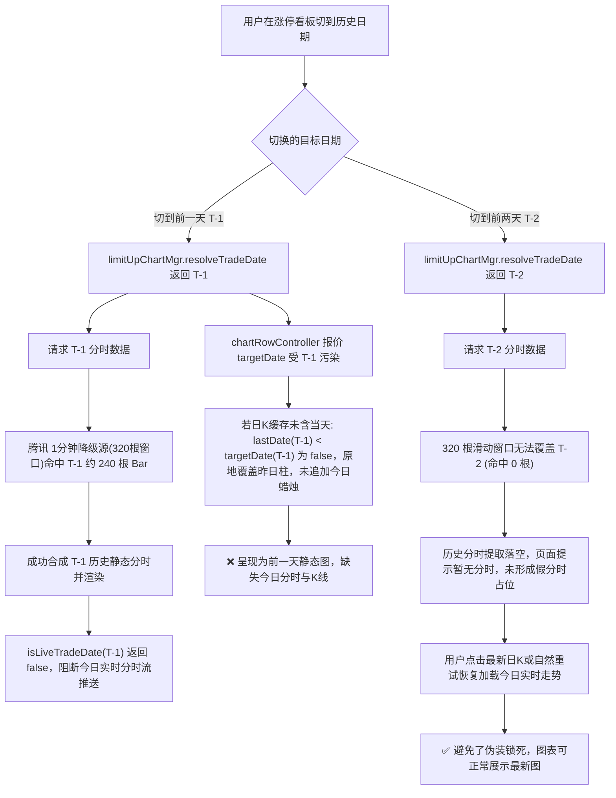

# 涨停看板切历史日期图表展示异常调查与根因方案交接

## 1. 背景与问题定义

在涨停看板（`#/limit-up`）的日期切换与图表联动中，用户反馈并实测发现以下异常现象：
- **前一天（T-1）**：当看板翻到前一个交易日（例如当前为 2026-09-14，翻到 2026-09-11），点击展开某只涨停标的的图表时，图表展示的是前一天的历史图，**完全缺少今天的日 K 蜡烛线和今天的日内分时**。
- **前两天（T-2）**：当看板翻到前两个交易日（例如 2026-09-10），展开图表却能正常展示最新图（包含今日日 K 蜡烛与今日实时分时走势）。
- **用户核心诉求**：涨停看板翻到历史日期主要是为了回顾过往涨停个股在“今天”的溢价、接力与持续性表现；展开图表时默认应当始终显示最新行情图（包括今日日 K 和今日分时）。用户要求全面审查图表相关逻辑，解释为什么只有前一天的图展示逻辑错误。

---

## 2. 根因深度剖析

经过对全链路代码（包括日期解析、图表控制器、分钟线合成及上游滑动窗口）的审计，确定该现象由 **业务层的人为日期锁定** 与 **上游分钟线 320 根滑动窗口机制** 共同引发。



### 2.1 机制一：`limitUpChartMgr.resolveTradeDate` 的历史日期强绑定

在 [`src/js/app.js:414-419`](file:///d:/AiPrograms/project1/market-voice-alert/src/js/app.js#L414-L419)：
```javascript
resolveTradeDate: (code, data) => {
  const dates = state.tradingDates || state.limitUp.tradingDates || [];
  const latestTradeDate = resolveLatestTradingDate(getBeijingDate(), dates);
  const isHistorical = state.limitUp.selectedDate && latestTradeDate && state.limitUp.selectedDate < latestTradeDate;
  return isHistorical ? state.limitUp.selectedDate : resolveInitialTradeDate(code, data);
}
```
自选监控页（[`monitorChartMgr`](file:///d:/AiPrograms/project1/market-voice-alert/src/js/app.js#L387-L400)）始终使用 `resolveInitialTradeDate`（即今天）。而在以前某次缺陷修复中，开发者为 `limitUpChartMgr` 增加了当 `selectedDate < latestTradeDate` 时强制返回 `state.limitUp.selectedDate` 的逻辑，导致展开图表时 `inst.selectedTradeDate` 被硬编码为历史日期。

### 2.2 机制二：上游 1 分钟 K 线降级源的 320 根滚动滑动窗口覆盖差异（为什么偏偏是前一天被锁）

1. **分钟源接口与滑动窗口上限**：
   - 东方财富的 1 分钟 K 线接口（[`buildEastmoneyKlineUrl`](file:///d:/AiPrograms/project1/market-voice-alert/server/klineService.js#L40)）参数设置的上限为 1000 根（`lmt=1000`）。
   - 腾讯旧版 1 分钟降级接口（[`buildTencentKlineUrl`](file:///d:/AiPrograms/project1/market-voice-alert/src/js/kline.js#L200)）参数上限为 320 根 Bar（`lmt=320`）。
   - 在服务端实现中，分时服务（[`server/intradayService.js:203`](file:///d:/AiPrograms/project1/market-voice-alert/server/intradayService.js#L203)）在主历史源不可用时，会调用 `getCachedKline({ period: '1m' })` 降级提取历史分钟 Bar。当东财接口遇到限流冷却或故障降级使用腾讯源时，本地缓存的分钟 K 线（如 `data/cache/kline/sh600519/1m.json`）即受限于这 **320 根 Bar 的滚动滑动窗口**。
2. **A 股交易时间尺度**：
   A 股每个常规交易日包含 240 根 1 分钟 Bar（9:30-11:30 为 120 根，13:00-15:00 为 120 根）。
3. **320 根窗口的临界覆盖特性**：
   320 根 Bar 在时间尺度上**只能覆盖当天盘中部分（最多 240 根）加上前一个交易日（T-1，昨天）的部分或全部 Bar**，物理上绝不可能覆盖到前两天（T-2，需要 240 × 2 = 480 根）：
   - **当请求前一天（T-1）时**：[`server/intradayService.js:215`](file:///d:/AiPrograms/project1/market-voice-alert/server/intradayService.js#L215) 执行 `filterKlineItemsByDate(klineData.items, 'T-1')`，在 320 根窗口内**精准命中前一天的约 240 根 Bar**，成功拼装出前一天的完整静态分时走势并返回前端渲染。
   - **当请求前两天（T-2）时**：320 根窗口内匹配项为 0。在 AKTools 历史分钟源未就绪或未启动时，无法拼装出前两天的分钟走势，返回空数据或报错。
4. **实时推送切断**：
   当 `inst.selectedTradeDate` 被锁定为前一天（T-1）后，[`src/js/marketSession.js:138`](file:///d:/AiPrograms/project1/market-voice-alert/src/js/marketSession.js#L138) 的 `isLiveTradeDate(selectedDate)` 判定非当日返回 `false`，导致 [`chartRowController.js:135`](file:///d:/AiPrograms/project1/market-voice-alert/src/js/controllers/chartRowController.js#L135) 和 [`app.js:1324`](file:///d:/AiPrograms/project1/market-voice-alert/src/js/app.js#L1324) 彻底拒收并跳过今日的一切实时分时注入。

### 2.3 机制三：日 K 的 `applyLiveQuoteToKline` 覆盖逻辑抹杀今日蜡烛

在 [`src/js/controllers/chartRowController.js:380-389`](file:///d:/AiPrograms/project1/market-voice-alert/src/js/controllers/chartRowController.js#L380-L389)：
```javascript
const targetDate = q.tradingDay || q.date || q.quoteDate || inst.selectedTradeDate || getBeijingDate();
const quoteForKline = (q.tradingDay || q.quoteDate || q.date) ? q : { ...q, date: targetDate };
const merged = applyLiveQuoteToKline(inst.klineData.items, quoteForKline, inst.period);
```
当股票报价缺少显式日期字段时（例如东财行情流或快照未携带独立交易日字段），`targetDate` 兜底取了 `inst.selectedTradeDate`。
此时传入 [`src/js/kline.js:420`](file:///d:/AiPrograms/project1/market-voice-alert/src/js/kline.js#L420) 的 `applyLiveQuoteToKline`：
```javascript
if (period === '1d' && lastDate && targetDate && lastDate < targetDate) {
  return [...items, newBar]; // 追加今日新蜡烛
}
// 否则：原地修改最后一根 Bar！
const updated = { ...last, close: price };
return [...items.slice(0, -1), updated];
```
- **在开盘前或静态日 K 缓存场景下**（日 K 最后一根 Bar 截至前一交易日，`lastDate = 'T-1'`）：
  - 若在今日看板或监控页：`targetDate` 兜底为今日，`lastDate ('T-1') < targetDate ('Today')` 为 `true`，系统正常追加今日新蜡烛。
  - 若在 T-1 看板：`targetDate` 兜底取了 `inst.selectedTradeDate`（`T-1`），导致 `lastDate ('T-1') < targetDate ('T-1')` 判定为 `false`！
  - **系统没有为今天追加新蜡烛 Bar，反而把前一天的收盘柱直接修改覆盖成了今天的现价**！导致整个日 K 图在视觉上直接丢失了今天的 Bar。
- **在盘中网络拉取已包含今日 Bar 的场景下**（日 K 最后一根 Bar 为 `T`）：
  - 此时 `targetDate` 若为 `T-1`，`lastDate ('T') < targetDate ('T-1')` 同样为 `false`，也会原地修改最后一根柱子。但更严重的是配合机制二，整个分时图区域完全呈现为 T-1 的静态 240 点曲线且被拒收实时推送，造成视觉与交互全盘沦为“前一天的图”。

### 2.4 掩盖点：`isLatestKlineDate` 的逻辑假阳性

在 [`src/js/app.js:714-719`](file:///d:/AiPrograms/project1/market-voice-alert/src/js/app.js#L714-L719)：
```javascript
function isLatestKlineDate(inst, date) {
  if (!date) return false;
  if (isLimitUpDateToday(date)) return true;
  if (!inst || !inst.klineData || !Array.isArray(inst.klineData.items)) return false;
  return getLastKlineDate(inst.klineData.items) === date;
}
```
当日 K 最后一根 Bar 为前一天时，传入前一天 `date`，`getLastKlineDate === date` 判定为 `true`。系统误以为“昨天就是最新日期”，形成了闭环假象。

---

## 3. 为什么“前两天”能够正常展示最新图？

通过比对前一天（T-1）与前两天（T-2）的链路差异，可以清晰解释为何只有前一天表现异常：

1. **320 根滑动窗口物理耗尽（关键分水岭）**：
   前两天（T-2）超出了腾讯 1 分钟降级源 320 根 Bar 的保留深度（需要 480 根以上），`filterKlineItemsByDate(items, 'T-2')` 返回 0 条匹配记录。在缺乏独立历史分时服务（AKTools）时，服务端无法合成 T-2 的旧分时走势。
2. **避免了“假分时伪装锁死”**：
   由于 T-2 的历史分时组装落空，分时图未被装填上具有迷惑性的完整静态 240 点历史曲线，前端状态显示“暂无分时 / 点击右侧日K查看分时”。
3. **用户自然交互引导加载最新**：
   在 T-2 时，由于分时为空，用户通常会点击日 K 柱子（点击最新的当天日 K 柱）；点击日 K 柱子触发 `handleKlineBarClick`，立即将 `inst.selectedTradeDate` 显式更新为当天日期并触发 `loadIntraday`，从而成功拉取并展示当天的实时分时与最新行情。
   而在 T-1 时，由于 320 根滑动窗口恰好“完美合成”了前一天的完整分时，系统陷入了假象闭环，用户并未触发手动点击日 K 的修复动作，最终呈现出“被前一天图表静默锁死”的现象。

---

## 4. 架构优化与修复方案

### 方案概述
1. **统一图表交易日解析契约**：
   修改 [`src/js/app.js:414-419`](file:///d:/AiPrograms/project1/market-voice-alert/src/js/app.js#L414-L419)，将 `limitUpChartMgr` 的 `resolveTradeDate` 调整为与 `monitorChartMgr` 一致，统一使用 `resolveInitialTradeDate(code, data)`。无论看板翻到哪一天，展开图表默认始终展示当下最新交易日。
2. **实时报价目标日期防污染**：
   在 [`src/js/controllers/chartRowController.js:383`](file:///d:/AiPrograms/project1/market-voice-alert/src/js/controllers/chartRowController.js#L383)，实时报价的 `targetDate` 兜底应当优先使用北京当前交易日（`resolveStockChartDate` 或 `getBeijingDate`），不再受任何历史 `selectedTradeDate` 污染，确保日 K 线始终追加今日蜡烛。
3. **保留历史分时查阅通道**：
   若用户确需查看某历史日期的分时走势，保留并依托成熟的原生能力：点击日 K 对应柱子（[`chartRowController.handleKlineBarClick`](file:///d:/AiPrograms/project1/market-voice-alert/src/js/controllers/chartRowController.js#L491)），即可精准切换至指定历史日期的分时。
