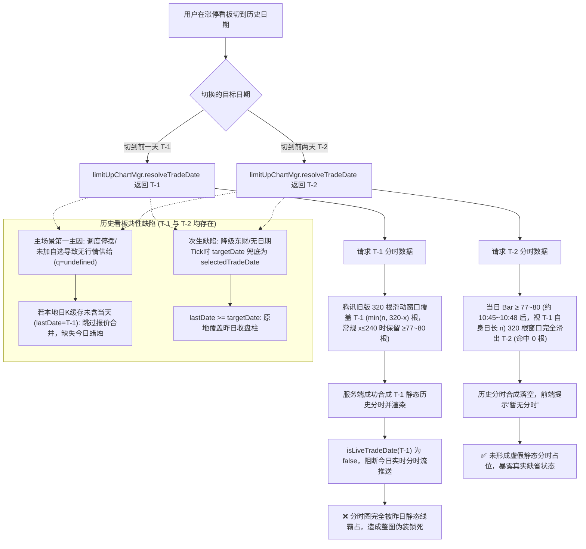

# 涨停看板切历史日期图表展示异常调查与根因方案交接

## 1. 背景与问题定义

在涨停看板（`#/limit-up`）的日期切换与图表联动中，用户反馈并实测发现以下异常现象：
- **前一天（T-1）**：当看板翻到前一个交易日（例如当前为 2026-09-14，翻到 2026-09-11），点击展开某只涨停标的的图表时，图表展示的是前一天的历史图，**完全缺少今天的日 K 蜡烛线和今天的日内分时**。
- **前两天（T-2）**：当看板翻到前两个交易日（例如 2026-09-10），展开图表时用户原始体感“能正常展示最新图”（实测日 K 正常显示且分时面板提示“暂无分时”，未被昨日历史数据伪装占领，未产生整图被昨日锁死的错觉）。
- **用户核心诉求**：涨停看板翻到历史日期主要是为了回顾过往涨停个股在“今天”的溢价、接力与持续性表现；展开图表时默认应当始终显示最新行情图（包括今日日 K 和今日分时）。用户要求全面审查图表相关逻辑，解释为什么只有前一天的图展示逻辑错误。

---

## 2. 根因深度剖析

经过对全链路代码（包括日期解析、图表控制器、分钟线合成及上游滑动窗口）的审计，确定该现象由 **业务层的人为日期锁定** 与 **上游分钟线 320 根滑动窗口机制** 共同引发。



### 2.1 机制一：`limitUpChartMgr.resolveTradeDate` 的历史日期强绑定

在 [`src/js/app.js:414-419`](file:///d:/AiPrograms/project1/market-voice-alert/src/js/app.js#L414-L419)：
```javascript
resolveTradeDate: (code, data) => {
  const dates = state.tradingDates || state.limitUp.tradingDates || [];
  const latestTradeDate = resolveLatestTradingDate(getBeijingDate(), dates);
  const isHistorical = state.limitUp.selectedDate && latestTradeDate && state.limitUp.selectedDate < latestTradeDate;
  return isHistorical ? state.limitUp.selectedDate : resolveInitialTradeDate(code, data);
}
```
自选监控页（[`monitorChartMgr`](file:///d:/AiPrograms/project1/market-voice-alert/src/js/app.js#L387-L400)）始终使用 `resolveInitialTradeDate`（即最新交易日/今天）。而在以前某次缺陷修复中，开发者为 `limitUpChartMgr` 增加了当 `selectedDate < latestTradeDate` 时强制返回 `state.limitUp.selectedDate` 的逻辑，导致展开图表时 `inst.selectedTradeDate` 被硬编码为历史日期。

### 2.2 机制二：上游 1 分钟 K 线降级源的 320 根滚动滑动窗口覆盖差异（为什么偏偏前一天发生伪装锁死）

1. **分钟源接口与滑动窗口深度**：
   - 东方财富 1 分钟 K 线接口（[`buildEastmoneyKlineUrl`](file:///d:/AiPrograms/project1/market-voice-alert/server/klineService.js#L40)）参数上限设为 1000 根（`lmt=1000`）。
   - 腾讯旧版 K 线构造函数 [`buildTencentKlineUrl`](file:///d:/AiPrograms/project1/market-voice-alert/src/js/kline.js#L194)（默认参数行位于 [`kline.js:200`](file:///d:/AiPrograms/project1/market-voice-alert/src/js/kline.js#L200)）其默认限制均为 **320 根 Bar**（`lmt=320`）。
   - 在服务端实现中，分时服务（[`server/intradayService.js:203`](file:///d:/AiPrograms/project1/market-voice-alert/server/intradayService.js#L203)）在主历史源不可用时，会调用 `getCachedKline({ period: '1m' })` 降级提取历史分钟 Bar。当东财接口遇到限流冷却（`klineService.js:86-122`）而降级回退到腾讯源时，本地缓存的分钟 K 线（如 `data/cache/kline/sh600519/1m.json`，源标为 `tencent-legacy`）严格受限于这 **320 根 Bar 的滚动滑动窗口**。
2. **A 股时间尺度与滑动窗口实际分布**：
   A 股每个常规交易日标准包含 240 根 1 分钟 Bar（早盘 9:30-11:30 与午盘 13:00-15:00 各 120 根；若腾讯等数据源计入 9:25 开盘集合竞价点则为 241/243 根）。在盘中运行时，320 根 Bar 的窗口容量随当日已生成 Bar 数 $x$ 呈现严格的数学推移：
   - **当天（T）**：盘中已产生的 Bar 数记为 $x$（例如上午 11:30 产生约 121 根 Bar）。
   - **前一天（T-1）**：窗口剩余容量在通用情况下为 $\min(n, 320 - x)$ 根（其中 $n \in \{240, 241, 243\}$ 为 T-1 日自身分钟 Bar 总数；在常规 $n = 240$ 下即 $\min(240, 320 - x)$ 根，例如上午 11:30 形成约 121 根时，剩余 $320 - 121 = 199$ 根，覆盖 T-1 日约 82% 的分钟线；盘前未开盘 $x=0$ 时则容纳完整 $n$ 根，即常规 240 根，或含集合竞价点时容纳 241/243 根）。
   - **前两天（T-2）**：T-2 在 320 根窗口中的实际保留根数严格服从通用公式 $\max(0, 320 - x - n)$（其中 $n \in \{240, 241, 243\}$ 为 T-1 当日 Bar 数）。在 T-1 为常规 240 根的标准前提下化简为 $\max(0, 80 - x)$；若 T-1 计入 9:25 开盘集合竞价等点位使 $n = 241$ 或 $243$ 根，则相应化简为 $\max(0, 79 - x)$ 或 $\max(0, 77 - x)$。即**在当日累积生成第 $320 - n$ 根 Bar（常规约第 80 根、约 10:48；若含集合竞价点则为第 77~79 根、约 10:45~10:47）之前，T-2 仍有 $\max(0, 320 - x - n)$ 根 Bar 留在窗口内（$x=0$ 盘前上限为 $320 - n$ 即 77/79/80 根）**；只有当盘中生成 Bar 数达到滑出阈值 $x \ge 320 - n$（即 $x \ge 77 \sim 80$）后，T-2 才被物理完全滑出 320 根窗口，匹配项彻底降为 0 根。
3. **分时合成的致命差异（前置条件：东财 1m 接口冷却回退腾讯 320 源，且 AKTools 历史分钟源不可用）**：
   - **同源同条件判定**：根据 [`server/intradayService.js:179-194`](file:///d:/AiPrograms/project1/market-voice-alert/server/intradayService.js#L179-L194) 的降级链路，AKTools 历史分钟源优先级高于第 203 行的 1m-K 降级。若 AKTools 历史源可用，T-1 与 T-2 均可获得真实历史分时（此时看到历史图系由 §2.1 日期绑定导致）；若 AKTools 历史源不可用，则 T-1 与 T-2 均降级至 320 根滑动窗口。
   - **当请求前一天（T-1）时**：[`server/intradayService.js:215`](file:///d:/AiPrograms/project1/market-voice-alert/server/intradayService.js#L215)（在 214 行守卫通过后）执行 `filterKlineItemsByDate(klineData.items, common.date)`（此处请求历史日即 'T-1'），在 320 根窗口内命中前一天的 $\min(n, 320 - x)$ 根 Bar（其中 $n \in \{240, 241, 243\}$ 为 T-1 日自身 Bar 数；在常规 $n = 240$ 且 $x \le 240$ 下，盘前未开盘 $x=0$ 时为 240 根，上午 11:30 $x \approx 121$ 时约 199 根，收盘 $x=240$ 时仍有 80 根，全天随 $x$ 递减并保持在 80~240 根；若 T-1 或当日计入集合竞价点使 $n$ 或 $x$ 达到 241/243 根，则收盘保留约 77~79 根），足以拼装出前一天的静态伪分时走势并返回前端渲染。
   - **当请求前两天（T-2）时**：若观察时刻在当日 10:45~10:48 之后（即 $x \ge 320 - n$，$x \ge 77 \sim 80$，视 T-1 自身 Bar 数 $n$），320 根窗口内 T-2 匹配项降为 0，无法拼装出走势，前端正常展示“暂无分时”。
4. **实时推送切断**：
   当 `inst.selectedTradeDate` 被锁定为历史日期（无论是 T-1 还是 T-2）后，[`src/js/marketSession.js:132`](file:///d:/AiPrograms/project1/market-voice-alert/src/js/marketSession.js#L132) 的 `isLiveTradeDate(selectedDate)` 判定非当日返回 `false`，导致 [`chartRowController.js:135`](file:///d:/AiPrograms/project1/market-voice-alert/src/js/controllers/chartRowController.js#L135) 和 [`app.js:1324`](file:///d:/AiPrograms/project1/market-voice-alert/src/js/app.js#L1324) 彻底拒收并跳过今日的一切实时分时注入。

### 2.3 机制三：日 K 行情供给断链与 `applyLiveQuoteToKline` 覆盖逻辑（历史看板通用缺陷）

在 [`src/js/controllers/chartRowController.js:380-389`](file:///d:/AiPrograms/project1/market-voice-alert/src/js/controllers/chartRowController.js#L380-L389)：
```javascript
const q = this.getQuote(code);
if (q) {
  const targetDate = q.tradingDay || q.date || q.quoteDate || inst.selectedTradeDate || getBeijingDate();
  const quoteForKline = (q.tradingDay || q.quoteDate || q.date) ? q : { ...q, date: targetDate };
  const merged = applyLiveQuoteToKline(inst.klineData.items, quoteForKline, inst.period);
  ...
}
```
传入 [`src/js/kline.js:402`](file:///d:/AiPrograms/project1/market-voice-alert/src/js/kline.js#L402) 的 `applyLiveQuoteToKline`（分支判断位于 [`kline.js:420`](file:///d:/AiPrograms/project1/market-voice-alert/src/js/kline.js#L420)）：
```javascript
if (period === '1d' && lastDate && targetDate && lastDate < targetDate) {
  return [...items, newBar]; // 追加今日新蜡烛
}
// 否则：原地修改最后一根 Bar！
const updated = { ...last, close: price };
return [...items.slice(0, -1), updated];
```
在历史看板下，日 K 缺失今日蜡烛存在两个清晰的层次：
1. **主场景第一主因：无报价供给（`q === undefined` 跳过合并）**：
   在真实生产管线中，股票快照行情主源为腾讯（[`api.js:150-176`](file:///d:/AiPrograms/project1/market-voice-alert/src/js/api.js#L150-L176)），`parseTencent` 在 `fields[30]` 为 14 位时会解析出 8 位 `quoteDate`（[`parser.js:64/82`](file:///d:/AiPrograms/project1/market-voice-alert/src/js/parser.js#L64-L82)）。当获取到腾讯主源报价时，`kline.js:409-420` 本可正常命中追加今日蜡烛分支。但在历史看板下，由于调度层停摆与刷新集合排除（详见 §4.1.5），对于未加入自选且非强势股的标的，`state.quotes` 中未被注入报价实体，`this.getQuote(code)` 返回 `undefined`，导致报价合并逻辑被完全跳过（若该标的已加入自选或已订阅，`state.quotes` 中可能存在其报价实体，报价合并不会跳过；但对于用户在历史看板中复盘的绝大多数普通涨停个股，该第一主因稳定触发）！若日 K 命中盘前生成的 1 小时静态缓存（`lastDate = 'T-1'`），今日蜡烛线完全无法生成。
2. **次生缺陷：东财降级或无日期 Tick 下的原地覆盖**：
   当腾讯主源发生异常降级回退至东财快照（[`parser.js:93-127`](file:///d:/AiPrograms/project1/market-voice-alert/src/js/parser.js#L93-L127)，无日期字段）、腾讯字段缺失、或外部/增量 Tick 注入无日期对象时，`targetDate` 退化兜底取了 `inst.selectedTradeDate`。此时 `lastDate < targetDate` 判定恒为 `false`（对于 T-1 看板，`T-1 < T-1` 为假；对于 T-2 看板，`T-1 < T-2` 亦为假），系统不但没有追加新蜡烛，反而把前一天的收盘柱原地覆盖修改成了现价！

- **真实生产快照输入下的行为与预期对比表（`items` 初始末柱为 `2026-09-11`，与 §4.2 场景对齐）**：

| 测试用例 / 输入报价形态 | 数据源特征与字段状态 | 旧代码合并表现 | 修复后预期表现 |
| :--- | :--- | :--- | :--- |
| **A1: 纯价格无日期快照** | `{ price: 21.00 }`（单测/外部无日期源注入） | 原地覆盖（按调用路径区分）：<br/>- `loadKline` 路径：`targetDate = inst.selectedTradeDate = '2026-09-11'`（非 `null`，兜底链命中 `selectedTradeDate` 退化为历史日期），`lastDate < targetDate` 为假导致原地覆盖；<br/>- `applyLiveTick` 路径：`quoteOrPrice` 无日期透传致 `targetDate = null`，落入原地覆盖；<br/>二者均导致 `len = 2`，末根 `2026-09-11` 收盘价被篡改为 21.00 | 统一规范化追加新蜡烛：经 `resolveLiveFallbackDate` 解析目标日期为今日可用交易日 `2026-09-14`，`len = 3`，正确追加今日 Bar 且历史 `2026-09-11` 柱完整保持原样 |
| **A2: 腾讯主源正常报价** | `{ price: 21.00, quoteDate: '20260914' }`（`api.js:161` + `parser.js:82`） | 供给阻断：历史看板下因调度停摆，未加自选标的 `q === undefined` 跳过合并，`len = 2` 停留在 `2026-09-11` | 调度保活后正常供给：`len = 3`，`kline.js:420` 正常命中追加 `2026-09-14` 新蜡烛 |
| **A3: 东财降级无日期快照** | 仅含常规指标、无任何日期字段（`api.js:172` + `parser.js:93-127`） | 原地覆盖：`targetDate` 退化为看板历史日，`len = 2`，昨日收盘价被篡改 | 统一兜底规范化：注入当前可用交易日，`len = 3` 追加 `2026-09-14` 新蜡烛，昨日柱保持原样 |

- **共性缺陷定性（核心澄清）**：
  无论是无报价供给导致的合并跳过，还是东财回退下的原地覆盖，对于所有历史看板（T-1 与 T-2）都是完全对称且普遍存在的底层缺陷，绝非 T-1 独有。

### 2.4 语义说明：`isLatestKlineDate` 的返回值假阳性及其行为中和

在 [`src/js/app.js:714-719`](file:///d:/AiPrograms/project1/market-voice-alert/src/js/app.js#L714-L719)：
```javascript
function isLatestKlineDate(inst, date) {
  if (!date) return false;
  if (isLimitUpDateToday(date)) return true;
  if (!inst || !inst.klineData || !Array.isArray(inst.klineData.items)) return false;
  return getLastKlineDate(inst.klineData.items) === date;
}
```
当日 K 缓存最后一根 Bar 为前一天时，传入前一天 `date`，`getLastKlineDate === date` 判定返回 `true`，在语义上呈现出“昨天被判定为最新日期”的假阳性。
**行为影响说明**：经调用链追踪，`isLatestKlineDate` 的唯一消费方为 `chartRowController.js:445` 中传递给分时请求的 `allowLatestTickSource`。在服务端 [`server/intradayService.js:261`](file:///d:/AiPrograms/project1/market-voice-alert/server/intradayService.js#L261)，`allowLatest` 被守卫 `allowLatestTickSource && !isHistoricalDate(dateKey)` 拦截。对任何历史日期（`dateKey < todayKey`，[`intradayService.js:24-27`](file:///d:/AiPrograms/project1/market-voice-alert/server/intradayService.js#L24-L27)），`!isHistoricalDate` 恒为 `false`，彻底中和了该假阳性。因此，该假阳性并未参与改变历史分时的取源行为，不作为独立缺陷成因，此处仅做语义严谨性归档。

---

## 3. 为什么用户会觉得“只有前一天展示错误，前两天没有问题”？

由于日 K 覆盖逻辑对 T-1 与 T-2 是对称的，**导致用户体验出现巨大反差的真正元凶，是分时侧伪装占领的对比差异**：

1. **前一天（T-1）：“假分时”成功装填，达成整图伪装锁死**：
   - 腾讯 320 根滑动窗口刚好容纳了 T-1 的分钟线（随当日已产生 Bar 数 $x$ 动态变化，通用等于 $\min(n, 320 - x)$ 根，其中 $n \in \{240, 241, 243\}$；在常规 $n = 240$ 且 $x \le 240$ 下，11:30 前后 $x \approx 121$ 时约 199 根，早盘 $x \le 80$ 时为满仓 240 根，收盘 $x=240$ 时仍有 80 根；若含集合竞价点使 $n$ 或当日达 241/243 根则收盘约 77~79 根），分时图画出了一条看似“极其完整、真实”的历史走势；
   - 随后 `isLiveTradeDate(T-1)` 默默关死了今日实时推送；
   - 叠加日 K 的静态展示，用户看到的是一张**表面毫无破绽、但完完全全属于昨天的全套图表**。用户期望看到今天的接力走势，却被昨天的假分时死死占领，因而强烈感知到“展示的是前一天的图，少了今天的分时和K线”。
2. **前两天（T-2）：滑动窗口物理耗尽（盘中第 77~80 根 Bar 之后，视 T-1 自身 Bar 数），暴露真实缺省状态**：
   - 在用户观察时刻处于 10:45~10:48 之后时（即盘中累积生成 $x \ge 320 - n$ 根 Bar，常规为第 80 根、集合竞价为第 77~79 根），T-2 跌出了 320 根滑动窗口的物理极限（匹配降为 0 根），服务端无法合成走势，分时图直接显示“暂无分时 / 点击右侧日K查看分时”；
   - **分时图没有被假数据占领**，暴露了真实缺省状态；
   - 在日 K 缓存已含今日柱的前提下（若日 K 缓存仍停留在 T-1，则 T-2 与 T-1 同样缺今日柱 —— 见 §2.3 共性缺陷），日 K 正常显示今日柱，分时提示暂无；用户并不会产生“这是一张完美的前天历史图”的错觉。
3. **结论**：
   用户感知到的“只有前一天图表展示逻辑错误”，是因为在东财 1m 冷却且 AKTools 历史源未就绪的前提下：**T-1 恒处于 320 根滑动窗口能够合成历史伪分时的覆盖带内**，形成了“伪静态分时 + 推送静默切断”的闭环；而用户在 10:45~10:48 之后（即盘中累积满 77~80 根 Bar 之后）查看 T-2 时，T-2 已滑出 320 根窗口（匹配降为 0），伪装链条破裂，暴露出“暂无分时”的真实状态！

---

## 4. 架构优化与修复方案

### 4.1 总体架构设计与职责边界划分

要彻底根治历史日期翻页带来的图表锁死与时序混乱，必须确立清晰的系统职责边界与设计原则：

1. **历史需求溯源与 P0-3 验收口径演进（架构重构决策）**：
   - 查阅既有技术交接记录（[`docs/handoff/2026-09-03-code-review-bugs-architecture-handoff.md:94-113`](file:///d:/AiPrograms/project1/market-voice-alert/docs/handoff/2026-09-03-code-review-bugs-architecture-handoff.md#L94-L113)），该历史日期绑定逻辑最初由提交 `32da3ca` 作为 `P0-3` 需求在 `loadLimitUpKline` 中引入（目标为“允许看历史涨停板的用户查看历史当天的拉板轨迹”），随后在提交 `eae67ae` 进行 `ChartRowManager` 统一架构重构时迁移至 `limitUpChartMgr.resolveTradeDate`（即现有的 `app.js:414-419` `isHistorical` 逻辑分支）。
   - 然而，旧版 P0-3 采取在图表初始化时“强制将实例日期绑定为历史看板筛选日”的粗粒度策略，引发了严重的架构负效应：导致 T-1 看板展开时被 320 根滑动窗口伪分时锁死，且完全阻断了用户查阅当下最新行情与接力溢价的核心诉求。
   - 根据用户最新明确指令（“翻到前一天时，图表也应显示最新 K 线图，少了今天的 K 线和分时”），**本方案正式废止并演进旧版 P0-3 的粗暴绑定口径**：
     - **默认初始态**：统一重构为展示最新行情（当下全量日 K 与今日最新分时），优先服务用户复盘过往涨停在当下的市场表现这一高频核心诉求；
     - **历史分时查阅通道演进**：旧版 P0-3 诉求的“查看历史拉板分时”能力，被完整迁移至成熟的原生交互机制——用户若确需回溯历史分时，在右侧日 K 图中主动点击对应历史蜡烛柱（[`chartRowController.handleKlineBarClick`](file:///d:/AiPrograms/project1/market-voice-alert/src/js/controllers/chartRowController.js#L491)），即可平滑触发历史分时下钻，两者清晰解耦、各司其职。
2. **状态职责正交分离（核心原则）**：
   - **看板列表筛选日期（`state.limitUp.selectedDate`）**：其职责仅限于**涨停股票列表的数据集过滤与历史回溯**（即筛选出指定历史交易日上榜的标的池）。
   - **图表实例初始日期（`inst.selectedTradeDate`）**：展开图表的核心用户诉求是**复盘过往涨停标的在“当下”的溢价、接力与最新价格走势**。因此，无论列表当前筛选哪一天，新展开的图表默认**以最新可用交易日（`latestTradingDay` / 盘中为今日，开盘前 09:15 前按交易日历自动锚定上一交易日）作为初始上下文**，严禁被列表的筛选日期劫持。
3. **主动下钻 vs 默认呈现**：
   - **默认呈现**：展开即展示当下全量日 K 与今日最新分时（具备实时 Tick 注入与定时刷新）。
   - **主动下钻通道**：保留并依托成熟的原生交互能力——用户若确需回溯某历史日期的分时细节，在右侧日 K 图中主动点击对应历史蜡烛柱（[`chartRowController.handleKlineBarClick`](file:///d:/AiPrograms/project1/market-voice-alert/src/js/controllers/chartRowController.js#L491)），由显式的人机交互触发分时切换。
4. **实时时钟防污染与多链路统一日期规范化**：
   - 实时行情（Live Quote）在语义上代表最新市场快照。在真实管线中，股票快照主源为腾讯（[`api.js:150-176`](file:///d:/AiPrograms/project1/market-voice-alert/src/js/api.js#L150-L176)），其解析器在时间戳完整时能产出 8 位 `quoteDate`（[`parser.js:64/82`](file:///d:/AiPrograms/project1/market-voice-alert/src/js/parser.js#L64-L82)）；但当腾讯故障回退至东财快照（[`parser.js:93-127`](file:///d:/AiPrograms/project1/market-voice-alert/src/js/parser.js#L93-L127)，无日期字段）、腾讯字段异常或外部增量 Tick 注入无日期对象时，报价缺少显式日期字段。为消除此类场景下的原地覆盖风险，必须由控制器统一提供日期兜底规范化函数（`resolveLiveFallbackDate`）：
     - **对于股票标的**：其对应的目标日期**回退兜底必须锚定交易日历的当前可用交易日**（[`resolveStockChartDate`](file:///d:/AiPrograms/project1/market-voice-alert/src/js/tradeCalendar.js#L118)），严禁退化回退到图表实例可能持有的股票历史 `selectedTradeDate`，也严禁因无日期而导致 `targetDate = null`；
     - **对于期货标的（`isFutureCode(code)`）**：期货标的实例持有的 `selectedTradeDate` 是由期货 session 计算得出的有效交易日（夜盘自然日可能跨日），继续保留其实例交易日的合法有效性。
   - 该日期规范化必须**无死角覆盖图表控制器的全部实时合并链路**：既包括初次加载的 `loadKline` 路径，也必须覆盖高频增量推送的 `applyLiveTick` 路径（通过在 `applyLiveTick` 调度点为缺少日期字段的纯价格报价注入 `fallbackDate`），避免任何未携带日期的报价对象进入 `applyLiveQuoteToKline` 导致 `targetDate = null` 进而原地覆盖昨日收盘柱。
5. **行情调度层与活跃图表订阅双解耦原则（Active Chart Subscription & Schedule Decoupling）**：
   - 图表的“日 K 追加今日蜡烛”与“分时实时 Tick 注入/10s 定时刷新”，根本上依赖底层 `state.quotes` 中存在该标的的实时报价。
   - **调度层与订阅集合双重断裂根因**：
     1. **调度层停摆**：在 `#/limit-up` 路由入口（[`app.js:1607`](file:///d:/AiPrograms/project1/market-voice-alert/src/js/app.js#L1607)）显式调用了 `stopMonitorTimer()`；且在 `app.js:1513-1515` 的 `applyDataRefreshSchedule()` 中，由于处于涨停页（`hasLimitUpRoot = true`），传入 `monitorCtrl.applySchedule(allowed, !hasLimitUpRoot)` 的 `visible` 参数被硬编码为 `false`，导致 [`monitorController.js:82`](file:///d:/AiPrograms/project1/market-voice-alert/src/js/controllers/monitorController.js#L82) 判定 `!visible` 直接执行 `stopTimer()` 清空定时器！全站负责高频拉取并写入 `state.quotes` 的后台 `setInterval` 永不建立！`limitUpController` 自身的定时器仅拉取涨停列表、改写 `lu.items`，**绝不写入 `state.quotes`**。
     2. **订阅集合排除**：[`src/js/controllers/monitorController.js:17`](file:///d:/AiPrograms/project1/market-voice-alert/src/js/controllers/monitorController.js#L17) 将涨停标的刷新纳入条件与“看板日期为今天”绑定（`state.limitUp.selectedDate === getBeijingDate()`），导致翻到历史日期时，历史涨停标的彻底被移出 `getRefreshCodes()`。
     3. 若只修改订阅集合合流而不修复调度层，`getRefreshCodes()` 的唯一消费方（已死亡的 `refresh()`）永远不会被执行，`state.quotes` 依然为空，图表依然陷入冻结。
   - **双重解耦设计**：
     - **调度层保活**：在 `app.js:1513-1515` 确立共享行情保活机制，将 `monitorCtrl.applySchedule(allowed, !hasLimitUpRoot)` 纠正为 `monitorCtrl.applySchedule(allowed, true)`（或显式定义 `const needsSharedQuotes = true;` 声明全站各路由视图均依赖全局 `state.quotes` 共享行情流与活跃图表订阅），彻底消除在涨停页下 `visible` 被误置为 `false` 进而清空定时器的调度断裂；并在 `app.js:1607` 路由切换处移除无条件的 `stopMonitorTimer()`（改为仅通过 `closeAllCharts()` 清理图表实例，保留全局后台行情轮询）。
     - **订阅集合合流**：将全站已展开图表的标的集合（`state.limitUp.expandedCodes`、`state.expandedCodes`、`state.momentum.expandedCodes`）作为独立的活跃图表订阅源，无条件合流进入 `getRefreshCodes()`。只要图表处于展开状态，后台便自动为其轮询最新报价，驱动日 K 蜡烛追加、Tick 更新与分时定时刷新。

---

### 4.2 具体改动点与实施细则（含代码变更对比）

#### 改造点一：统一图表交易日解析契约（移除看板历史日期劫持）
- **涉及文件**：[`src/js/app.js:414-419`](file:///d:/AiPrograms/project1/market-voice-alert/src/js/app.js#L414-L419)
- **问题现状**：
  目前 `limitUpChartMgr` 的 `resolveTradeDate` 检查 `isHistorical`，若看板处于历史日期则强行返回 `state.limitUp.selectedDate`，导致实例初始化时 `selectedTradeDate` 被硬编码为历史日期。
- **改动方案**：
  将 `limitUpChartMgr` 的 `resolveTradeDate` 调整为与自选监控页 [`monitorChartMgr`](file:///d:/AiPrograms/project1/market-voice-alert/src/js/app.js#L387-L400) 保持完全一致，统一直接委托给 `resolveInitialTradeDate(code, data)`。
- **代码对比**：
  ```javascript
  // 修改前 (src/js/app.js:414-419)
  resolveTradeDate: (code, data) => {
    const dates = state.tradingDates || state.limitUp.tradingDates || [];
    const latestTradeDate = resolveLatestTradingDate(getBeijingDate(), dates);
    const isHistorical = state.limitUp.selectedDate && latestTradeDate && state.limitUp.selectedDate < latestTradeDate;
    return isHistorical ? state.limitUp.selectedDate : resolveInitialTradeDate(code, data);
  },

  // 修改后 (src/js/app.js)
  resolveTradeDate: (code, data) => resolveInitialTradeDate(code, data),
  ```
- **技术效果**：
   - 无论看板翻到 T-1、T-2 还是更早，在行情报价不携带历史交易日的前提下，点击展开图表时 `selectedTradeDate` 始终被解析为当前最新**可用**交易日（盘中为当天，开盘前 09:15 前按交易日历自动锚定上一交易日），看板历史日期不再拥有图表初始化日期的劫持权。
   - 默认初始化展开时，分时图直接请求当前最新可用交易日（盘中即今日）的分时数据，不再默认自动向服务端请求历史看板日期的分时，从根源上杜绝了 320 根滑动窗口合成历史伪分时、并将图表锁死在昨日静态数据的行为。

#### 改造点二：实时报价目标日期防污染（全链路抽取纯函数与防覆盖统一注入）
- **涉及文件**：[`src/js/controllers/chartRowController.js:108-116`](file:///d:/AiPrograms/project1/market-voice-alert/src/js/controllers/chartRowController.js#L108-L116)、[`:380-390`](file:///d:/AiPrograms/project1/market-voice-alert/src/js/controllers/chartRowController.js#L380-L390)、[`:533-539`](file:///d:/AiPrograms/project1/market-voice-alert/src/js/controllers/chartRowController.js#L533-L539)（同时需引入 [`resolveStockChartDate`](file:///d:/AiPrograms/project1/market-voice-alert/src/js/tradeCalendar.js#L118)）
- **问题现状**：
  1. 在 `loadKline` 阶段合并实时报价时，`targetDate` 兜底链包含了 `inst.selectedTradeDate`。一旦实例被设为历史日期且报价缺少显式日期字段，`targetDate` 退化为历史日期，触发 [`kline.js:420`](file:///d:/AiPrograms/project1/market-voice-alert/src/js/kline.js#L420) 的 `lastDate < targetDate = false`，导致昨日柱被原地覆盖、今日蜡烛丢失。
  2. 在后续实时 Tick 推送阶段（`applyLiveTick` → `applyLiveTickToKlineChart`），股票报价主源（腾讯）正常带有 `quoteDate`（[`parser.js:82`](file:///d:/AiPrograms/project1/market-voice-alert/src/js/parser.js#L82)）；但在腾讯故障降级回退至东财快照（[`parser.js:93-127`](file:///d:/AiPrograms/project1/market-voice-alert/src/js/parser.js#L93-L127)，无日期字段）、腾讯字段缺失、或外部/单测直接注入 `{ price: 21 }` 等无日期对象时，`quoteOrPrice` 作为无日期对象直接透传给 `applyLiveQuoteToKline`，导致其内部 `rawTargetDate` 为空、`targetDate = null`，从而落入 `kline.js:439-453` 的原地覆盖分支。若日 K 尚未加载出今日柱，每次 Tick 都会将昨日收盘柱篡改为今日现价！
  - **实测验证对比（以日 K 初始末柱为 `2026-09-11` 为例）**：
    - **A1 纯价格无日期快照 `{ price: 21.00 }`**：旧代码按调用路径区分：`loadKline` 路径 `targetDate = inst.selectedTradeDate = '2026-09-11'`（非 `null`，兜底链命中 `selectedTradeDate` 退化为历史日期），`lastDate < targetDate` 为假导致原地覆盖；`applyLiveTick` 路径无日期透传致 `targetDate = null`，落入原地覆盖；二者均导致 `len = 2`，末根 `2026-09-11` 收盘价被篡改为 21.00。修复后经 `resolveLiveFallbackDate` 统一规范化注入今日可用交易日 `fallbackDate = '2026-09-14'`，追加今日新蜡烛（`len = 3`，昨日柱完整保持原样）；
    - **A2 腾讯主源 `{ price: 21.00, quoteDate: '20260914' }`**：腾讯解析自带 `quoteDate`，进入 `applyLiveQuoteToKline` 正常追加（`len = 3`）；其在历史看板下缺失今日柱的第一因是**调度层停摆无报价供给**（`q === undefined` 跳过合并），而非 Tick 覆盖；
    - **A3 东财降级快照（无日期）**：旧代码退化为 `selectedTradeDate` 历史日，判定失败原地覆盖（`len = 2`）；修复后规范化为当前交易日，追加今日柱（`len = 3`）。
- **改动方案**：
  在 `chartRowController.js` 内部抽离模块级纯函数 `resolveLiveFallbackDate(code, inst, tradingDates)`，并将日期兜底规范化同时注入到 **`loadKline`（初次合并）** 与 **`applyLiveTick`（增量推送）** 两处关键路径中。
- **代码对比**：
  ```javascript
  // 1. 新增纯函数与导入 (src/js/controllers/chartRowController.js)
  import { resolveStockChartDate } from '../tradeCalendar.js';

  export function resolveLiveFallbackDate(code, inst, tradingDates = []) {
    if (isFutureCode(code)) {
      return inst?.selectedTradeDate || getBeijingDate();
    }
    return resolveStockChartDate(tradingDates) || getBeijingDate();
  }

  // 2. loadKline 路径注入 (src/js/controllers/chartRowController.js:383)
  // 修改前:
  const targetDate = q.tradingDay || q.date || q.quoteDate || inst.selectedTradeDate || getBeijingDate();
  // 修改后:
  const fallbackDate = resolveLiveFallbackDate(code, inst, this.getTradingDates());
  const targetDate = q.tradingDay || q.date || q.quoteDate || fallbackDate;
  const quoteForKline = (q.tradingDay || q.quoteDate || q.date) ? q : { ...q, date: targetDate };

  // 3. applyLiveTick 路径注入 (src/js/controllers/chartRowController.js:533-539)
  // 修改前:
  applyLiveTick(code, quoteOrPrice) {
    const ctl = this.klineCtlMap.get(code);
    const inst = this.getInst(code);
    if (!ctl || !inst) return;
    applyLiveTickToKlineChart(ctl, inst, quoteOrPrice);
    this.updateKlineStatus(code);
  }
  // 修改后:
  applyLiveTick(code, quoteOrPrice) {
    const ctl = this.klineCtlMap.get(code);
    const inst = this.getInst(code);
    if (!ctl || !inst) return;
    const fallbackDate = resolveLiveFallbackDate(code, inst, this.getTradingDates());
    const quoteWithDate = (quoteOrPrice && typeof quoteOrPrice === 'object' && !quoteOrPrice.tradingDay && !quoteOrPrice.date && !quoteOrPrice.quoteDate)
      ? { ...quoteOrPrice, date: fallbackDate }
      : quoteOrPrice;
    applyLiveTickToKlineChart(ctl, inst, quoteWithDate);
    this.updateKlineStatus(code);
  }
  ```
- **技术效果**：
  - 彻底阻断无日期快照报价在 `applyLiveQuoteToKline` 内部 `targetDate` 成为 `null` 的可能；
  - 无论行情是由 `loadKline` 首次合并触发，还是由后续外部 Tick 增量推送触发，当今日蜡烛未就绪（`lastDate < targetDate`）时均能正确追加今日新蜡烛 Bar；当今日蜡烛已存在（`lastDate == targetDate`）时原地更新现价；双链路闭环杜绝覆盖昨日收盘柱。

#### 改造点三：历史下钻与实时监控的双向平滑切换机制
- **涉及文件**：[`src/js/controllers/chartRowController.js:491-503`](file:///d:/AiPrograms/project1/market-voice-alert/src/js/controllers/chartRowController.js#L491-L503)
- **交互流程保障**：
  1. **主动查看历史**：用户在日 K 上点击历史 Bar，`handleKlineBarClick` 捕获点击日期并更新 `inst.selectedTradeDate`，发起 `loadIntraday(code, date)` 加载该历史日期的分时。此时 [`isLiveTradeDate(selectedDate)`](file:///d:/AiPrograms/project1/market-voice-alert/src/js/marketSession.js#L132) 为 `false`，实时 Tick 自动阻断，分时状态文本明确标识该历史日期点数。
  2. **快速回到最新**：用户点击最右侧当天的日 K 柱子，`selectedTradeDate` 瞬间切换回今日，`loadIntraday` 重新加载今日全天分时。此时 `isLiveTradeDate` 恢复为 `true`，后续所有实时 Tick 增量推送立即无缝恢复注入。
  3. **重新展开重置**：用户折叠行再重新展开，始终触发初始化逻辑，稳定重置并呈现最新行情，不残留上次的历史下钻状态。

#### 改造点四：行情调度层与活跃图表订阅双解耦（保障历史看板标的行情供给）
- **涉及文件**：[`src/js/app.js:1508-1515`](file:///d:/AiPrograms/project1/market-voice-alert/src/js/app.js#L1508-L1515)、[`src/js/app.js:1602-1614`](file:///d:/AiPrograms/project1/market-voice-alert/src/js/app.js#L1602-L1614)、[`src/js/controllers/monitorController.js:14-22`](file:///d:/AiPrograms/project1/market-voice-alert/src/js/controllers/monitorController.js#L14-L22)
- **问题现状**：
  1. **调度层整体停摆**：
     在 `#/limit-up` 路由处理器（[`app.js:1607`](file:///d:/AiPrograms/project1/market-voice-alert/src/js/app.js#L1607)）中，显式调用了 `stopMonitorTimer()`；而在第 1613 行调用的 `applyDataRefreshSchedule()`（[`app.js:1508-1515`](file:///d:/AiPrograms/project1/market-voice-alert/src/js/app.js#L1508-L1515)）中，由于 `hasLimitUpRoot === true`，传入的 `visible = !hasLimitUpRoot = false`。[`monitorController.js:82`](file:///d:/AiPrograms/project1/market-voice-alert/src/js/controllers/monitorController.js#L82) 判定 `!visible` 直接执行 `stopTimer()`，导致后台定时器被彻底清空！且 `app.js:1542` 的 30s 调度检查器（`startChecker`）每 30 秒重复该判定，维持 `visible = false` 状态。
     `limitUpController` 自身的定时器仅拉取涨停列表、改写 `lu.items`，**绝不写入 `state.quotes`**；全站向 `state.quotes` 写入报价实体的点为 `monitorController.js:44/50`（常规轮询）、`app.js:952`（订阅开关用 momentum 条目兜底）、`momentumController.js:141/152`（10 日强势股扫描，`snapshot: true`），三者均不覆盖涨停看板展开的未加自选标的！
  2. **订阅集合门禁排除**：
     `monitorController.js:17` 的 `getRefreshCodes()` 规定：仅当 `state.limitUp?.selectedDate === getBeijingDate(clock())` 时，才将涨停列表标的纳入轮询集合。当看板翻到历史日期时，历史涨停标的（若未被加入自选且非强势股）被彻底移出订阅集合。
  3. **综合后果**：
     由于调度停摆 + 订阅排除，标的无法进入 `state.quotes`：
     - `chartRowController.js:380-382` 因 `q` 为 `undefined` 导致报价合并完全跳过，若命中盘前日 K 缓存则今日蜡烛完全无法生成；
     - `app.js:1354-1358` 循环因 `!q` 判定而 `continue`，实时 Tick 注入与 `refreshLiveIntradayForCode`（10s 分时刷新）被全部阻断，图表陷入冻结。
     - 若只改 `getRefreshCodes()` 而不恢复调度层，其唯一消费方 `refresh()` 永不执行，仍无法产生任何行情供给！
- **改动方案**：
  从“调度层”与“订阅集合层”两级同时完成解耦：
  1. **调度层保活**：在 `app.js:1513-1515` 将共享行情轮询判定纠正为保活语义（`monitorCtrl.applySchedule(allowed, true)`，或显式定义 `const needsSharedQuotes = true;` 表明全站路由视图均依赖全局 `state.quotes` 共享行情与活跃图表订阅），向 `monitorCtrl.applySchedule` 传入正确的 `visible = true` 语义（主修复点）；在 `app.js:1607` 路由入口处可选清理冗余的 `stopMonitorTimer()`（行 1607 的停摆会被紧随其后的行 1613 `applyDataRefreshSchedule()` 自动重建覆盖，其本身不影响最终保活结论，主语义完全取决于行 1515）。
  2. **订阅集合合流**：在 `monitorController.js:14-22` 将全站各页面已展开图表的 code 集合（`expandedCodes`）作为独立的活跃订阅源，统一合流注入 `getRefreshCodes()`。
- **代码对比**：
  ```javascript
  // 1. 调度层保活与可见性语义纠正 (src/js/app.js:1508-1515)
  // 修改前:
  const hasLimitUpRoot = Boolean(limitUpCtrl.getRootEl());

  monitorCtrl.applySchedule(allowed, !hasLimitUpRoot);
  // 修改后:
  const hasLimitUpRoot = Boolean(limitUpCtrl.getRootEl());

  // 主监控页与涨停看板均依赖全局 state.quotes 共享行情流与活跃图表订阅，保持后台轮询
  const needsSharedQuotes = true;
  monitorCtrl.applySchedule(allowed, needsSharedQuotes);

  // 2. 路由切换处保留后台共享行情轮询 (src/js/app.js:1602-1614)
  // 修改前:
  '#/limit-up': (r) => {
    if (searchSuggestCtrl) {
      searchSuggestCtrl.destroy();
      searchSuggestCtrl = null;
    }
    stopMonitorTimer();
    closeAllCharts();
    closeAllMomentumCharts();
    limitUpCtrl.setRootEl(r);
    limitUpCtrl.render();
    limitUpFetch();
    applyDataRefreshSchedule();
  }
  // 修改后:
  '#/limit-up': (r) => {
    if (searchSuggestCtrl) {
      searchSuggestCtrl.destroy();
      searchSuggestCtrl = null;
    }
    // 可选清理冗余的 stopMonitorTimer()（其行为会被紧随其后的行 1613 applyDataRefreshSchedule() 覆盖），保持后台共享行情轮询；仅清理监控页图表实例
    closeAllCharts();
    closeAllMomentumCharts();
    limitUpCtrl.setRootEl(r);
    limitUpCtrl.render();
    limitUpFetch();
    applyDataRefreshSchedule();
  }

  // 3. 活跃图表订阅集合合流 (src/js/controllers/monitorController.js:14-22)
  // 修改前:
  function getRefreshCodes() {
    const state = getState();
    const codes = new Set([...(state.watchList || []), ...(state.subscribed || [])]);
    if (state.limitUp?.selectedDate === getBeijingDate(clock())) {
      for (const item of state.limitUp.items || []) if (item?.code) codes.add(item.code);
    }
    for (const item of state.momentum?.items || []) if (item?.code) codes.add(item.code);
    return [...codes];
  }
  // 修改后:
  function getRefreshCodes() {
    const state = getState();
    const codes = new Set([...(state.watchList || []), ...(state.subscribed || [])]);
    for (const c of state.limitUp?.expandedCodes || []) codes.add(c);
    for (const c of state.expandedCodes || []) codes.add(c);
    for (const c of state.momentum?.expandedCodes || []) codes.add(c);
    if (state.limitUp?.selectedDate === getBeijingDate(clock())) {
      for (const item of state.limitUp.items || []) if (item?.code) codes.add(item.code);
    }
    for (const item of state.momentum?.items || []) if (item?.code) codes.add(item.code);
    return [...codes];
  }
  // 4. 调度层测试与生命周期可观测接入点 (src/js/app.js:1645-1647)
  // 修改前:
  export function _internal() {
    return { state, chartInstanceMap, get limitUpRootEl() { return limitUpCtrl.getRootEl(); } };
  }
  // 修改后:
  export function _internal() {
    return {
      state,
      chartInstanceMap,
      get limitUpRootEl() { return limitUpCtrl.getRootEl(); },
      monitorCtrl,
      applyDataRefreshSchedule
    };
  }

  // 5. 调度定时器存活性明确可观测接入点 (src/js/controllers/monitorController.js:139-140)
  // 修改前:
  inspect: () => ({ inFlight: !!inFlight, timerCount: Number(timer !== null) + Number(checker !== null) + Number(preloadTimer !== null) })
  // 修改后:
  inspect: () => ({
    inFlight: !!inFlight,
    pollTimerAlive: timer !== null,
    pollTimerId: timer,
    timerCount: Number(timer !== null) + Number(checker !== null) + Number(preloadTimer !== null)
  })
  ```
- **技术效果**：
  - 用户停留在 `#/limit-up` 时，后台共享行情轮询定时器保持健康运转，不再被整体掐断；
  - 在历史看板展开任意标的图表后，该标的作为活跃图表订阅立即合流进入下一次 `fetchQuotes` 请求批次，在 1 个报价周期内（默认 10s，可配置 `3/10/30/60` 秒）自动填充进 `state.quotes`；
  - 驱动 `loadKline` 成功追加今日蜡烛（当命中盘前 1d 缓存时），驱动 `updateChartLastTickMulti` 持续注入 Tick 并维持 10s 分时定时刷新；
  - 暴露调度层访问器至 `_internal()` 并为 `monitorCtrl.inspect()` 扩充 `pollTimerAlive` 与 `pollTimerId` 字段，彻底排除常驻 `checker` 对 `timerCount` 的非零干扰，并为受控沙盒提供以唯一句柄精准提取被测定时器的纯身份键接入点；
  - 表格侧数据隔离完好：`limitUpController.js:259` 与 `:411` 的 `isLimitUpDateToday()` 门禁不受改动影响，历史看板表格行保持历史收盘数据，图表与表格职责明确解耦。

---

### 4.3 自动化测试与质量保障方案

为确保架构优化落地且绝不发生回归，需在现有 814 个测试用例基础上扩展以下针对性测试矩阵。

> [!IMPORTANT]
> **测试环境时钟基准与确定性约定（对齐既有 Harness）**：
> 仓库现有的单测底座（[`tests/_jsdom-setup.cjs:14-21`](file:///d:/AiPrograms/project1/market-voice-alert/tests/_jsdom-setup.cjs#L14-L21)）在离线单测模式下默认注入了 `TestDate`（锚点设为基准日 `2026-09-09T02:00:00Z` 即北京时间 `2026-09-09 10:00:00`，并累加实时时钟偏移）。
> 本测试矩阵在测试前置（`beforeEach`）中重设全局时钟与网络桩时，必须严格遵守以下约定：
> 1. **时钟 Mock 必须同时覆写 `constructor` 与 `static now()`**：
>    底座的 `TestDate.now()` 与无参构造共享内部计时锚点（`anchor + RealDate.now() - started`）。若测试中只覆写构造函数而不覆写 `static now()`，会导致 `new Date()` 与 `Date.now()` 返回不同的时刻，造成 `resolveStockChartDate` 与基于 `Date.now()` 的节流逻辑（如 `app.js:1325` 的 `Date.now() - inst.intradayLastFetchAt < 10000`）时钟分裂，产生偶发 Flaky。因此，任何时钟 Mock 必须统一规范为：
>    ```javascript
>    const RealDate = Date;
>    const fixedMs = Date.parse('2026-09-14T02:00:00Z'); // 北京时间 2026-09-14 10:00:00
>    globalThis.Date = class FixedDate extends RealDate {
>      constructor(...args) { super(...(args.length ? args : [fixedMs])); }
>      static now() { return fixedMs; }
>    };
>    ```
> 2. **网络与分时 Mock 约定（完整信封防 4 次降级报错）**：
>    生产代码中 `loadKline` 尾部在 `this.hasIntraday` 为真时（如 `limitUpChartMgr` 和 `monitorChartMgr`，`momentumChartMgr` 不会）调用 `this.loadIntraday(code, inst.selectedTradeDate)`（[`chartRowController.js:397-399`](file:///d:/AiPrograms/project1/market-voice-alert/src/js/controllers/chartRowController.js#L397-L399)），进而发起 `/api/cache/intraday` 网络请求。
>    根据 [`src/js/api.js:415`](file:///d:/AiPrograms/project1/market-voice-alert/src/js/api.js#L415)，客户端严格校验响应信封 `json.ok === true && json.data`。若 Mock 桩仅返回内层 data（例如 `{ items: [], prevClose: 20.00 }`），将触发校验失败抛错，进而使 `fetchIntraday` 连续发起 2 次东财 1m K、1 次腾讯 mkline 等至少 4 次降级网络请求（当 `allowLatestTickSource` 为真时额外发起 1 次 `trends2` 请求，共计 5 次），最终撞上底座（[`tests/_jsdom-setup.cjs:22-27`](file:///d:/AiPrograms/project1/market-voice-alert/tests/_jsdom-setup.cjs#L22-L27)）的 `Unexpected network request` 致命断言。
>    因此，所有调用 `loadKline` 的单测用例提供的 Mock 桩必须包裹完整信封：
>    ```javascript
>    { ok: true, data: { items: [], prevClose: 20.00 } }
>    ```
>    或参考 [`tests/chartRequestOwnership.test.js:6-8`](file:///d:/AiPrograms/project1/market-voice-alert/tests/chartRequestOwnership.test.js#L6-L8) 统一接管全局 `fetch` 响应全部端点，保证 1 次请求即正常短路返回，调用链路畅通无报错。
> 3. **定时器 Mock 与受控驱动约定（按 id 隔离的多定时器自闭环沙盒与纯身份键绑定）**：
>    仓库 `devDependencies` 无 `sinon` / `@sinonjs/fake-timers` 外部依赖，现有定时器测试均采用受控沙盒。在 `applyDataRefreshSchedule()` 执行路径中，若 `hasLimitUpRoot = true` 且处于盘中，系统会先后注册 `monitorCtrl` 的行情轮询定时器（`ms = state.refreshInterval`，默认 `10000`，可选 `3000/10000/30000/60000`）以及 `limitUpCtrl` 的涨停列表定时器（`ms = lu.refreshInterval`，默认 `30000`，可选 `10000/30000/60000`）。若用户持久化配置使 `state.limitUp.refreshInterval === state.refreshInterval`（例如同为 `10000`、`30000` 或 `60000`），二者将具有相同数值的 `ms`。为彻底避免单槽覆盖与同周期混淆、确保在 `state.limitUp.refreshInterval × state.refreshInterval` 全组合下均能 100% 身份型唯一选中，方案采取纯身份键绑定机制（亦可在单测驱动前显式置 `state.limitUp.autoRefreshEnabled = false` 进行前置隔离防御）：
>    沙盒采用自增 id 映射表（`registeredTimers = new Map()`）管理，`monitorCtrl.inspect()` 显式暴露内部持有的唯一句柄 `pollTimerId: timer`，单测直接通过 `registeredTimers.get(pollTimerId)` 提取被测行情轮询条目，彻底杜绝依赖数值 `ms` 互异或注册先后顺序的隐式假设。并在 `afterEach` 中严格原样还原全局函数，杜绝跨测试用例状态泄漏：
>    ```javascript
>    const registeredTimers = new Map();
>    let timerSeq = 1000;
>    const originalSetInterval = globalThis.setInterval;
>    const originalClearInterval = globalThis.clearInterval;
>    // beforeEach:
>    registeredTimers.clear();
>    globalThis.setInterval = (fn, ms) => {
>      const id = ++timerSeq;
>      registeredTimers.set(id, { fn, ms });
>      return id;
>    };
>    globalThis.clearInterval = (id) => {
>      registeredTimers.delete(id);
>    };
>    // afterEach:
>    globalThis.setInterval = originalSetInterval;
>    globalThis.clearInterval = originalClearInterval;
>    registeredTimers.clear();
>    ```
>    驱动行情轮询周期时，通过 `_internal().monitorCtrl.inspect().pollTimerId` 获取绑定的句柄条目并直接执行其回调（断言 `pollTimer !== undefined && pollTimer.ms === state.refreshInterval`），严禁手动调用 `refresh()` / `_forceRefresh()` 绕过调度层。
> 
> 因此，除「用例 5」的盘前子场景需局部特化时钟外，以下常规盘中用例统一在 `beforeEach` 中按上述规范将全局 `Date`（含 `now()`）显式重设为目标盘中固定时刻（`2026-09-14 10:00:00+08:00`），在 `afterEach` 中恢复为底座的 `TestDate` 默认锚点。
> 同时，测试通过 [`app.js:1645 _internal()`](file:///d:/AiPrograms/project1/market-voice-alert/src/js/app.js#L1645) 访问内部状态与调度层句柄（包含 `state`、`chartInstanceMap`、`limitUpRootEl`、`monitorCtrl`、`applyDataRefreshSchedule`），注入包含 `['2026-09-10', '2026-09-11', '2026-09-14']` 的交易日历，并 Mock 基础 `fetchKline` 桩数据及实时报价桩，保证调用链路畅通执行。

1. **涨停看板图表初始化交易日单测**（扩展 `tests/chartRowController.test.js` 或新建 `tests/limitUpChartInit.test.js`）：
   - **用例 1**：在 Mock 盘中时刻（`2026-09-14 10:00:00`）且交易日历包含 `['2026-09-10', '2026-09-11', '2026-09-14']` 下，模拟看板处于历史日期 `state.limitUp.selectedDate = '2026-09-11'`（T-1）。完整执行实例注册与展开调用序列（对照生产代码 `limitUpController.js:564-567` 的注册与展开链路，在单测中直接注册实例并调用底层 manager）：
     ```javascript
     lu.expandedCodes.add(code);
     lu.chartInstances.set(code, createChartState('1d'));
     await limitUpChartMgr.loadKline(code);
     ```
     断言实例初始化完成后的 `selectedTradeDate` 最终为当前最新可用交易日（`2026-09-14`），而非看板历史日期 `2026-09-11`。
   - **用例 2**：在 Mock 盘中时刻（`2026-09-14 10:00:00`）下，模拟看板翻到 `state.limitUp.selectedDate = '2026-09-10'`（T-2），同样执行上述标准注册与展开调用序列，断言初始化的 `selectedTradeDate` 恒为最新可用交易日（`2026-09-14`）。
2. **实时报价日期防污染与追加日 K 蜡烛单测**（扩展 `tests/chartRowController.test.js`）：
   - **用例 3**：在 Mock 盘中时刻（`2026-09-14 10:00:00`）下，构造 `inst.selectedTradeDate = '2026-09-11'`（模拟用户正在看历史分时），日 K 历史列表最后一根为 `2026-09-11`，注入不带日期字段的纯价格报价 `{ price: 21.00 }`。执行 `loadKline` 报价合并逻辑，断言合并后的日 K 数据项成功追加了 `2026-09-14` 的新蜡烛 Bar（数组长度加 1），且上一根（`2026-09-11`）的收盘价与成交量保持原样未被覆盖。
3. **历史分时点击下钻与回归今日的闭环测试**：
   - **用例 4**：在 Mock 盘中时刻（`2026-09-14 10:00:00`）下，模拟点击历史 Bar，验证 `inst.selectedTradeDate` 切换为历史日期且 `loadIntraday` 被调用，此时 `isLiveTradeDate` 返回 `false`；再模拟点击最新（`2026-09-14`）柱子，验证 `selectedTradeDate` 回归且 `isLiveTradeDate` 准确恢复为 `true`。
4. **共享控制器多资产及多场景回归单测**：
   - **用例 5**：
     - **期货子场景**：在 Mock 盘中时刻（`10:00:00`）下，构造期货标的（如 `AU0`，`isFutureCode(code) === true`），验证其在行情缺少日期字段时，目标日期优先采用其实例持有的期货交易日，不受股票日历污染；
     - **盘前子场景（特化时钟）**：独立将全局 `Date` 局部 Mock 至盘前时刻（如 `2026-09-14 09:00:00+08:00`，满足 `hour*60+minute < 9*60+15`），验证 `momentumChartMgr`（无分时模式）合并报价时由 `resolveStockChartDate` 确定性锚定至上一交易日（`2026-09-11`），不再向日 K 注入未开盘当天的幽灵 Bar。
5. **活跃图表订阅与调度层保活端到端单测（P1 闭环覆盖）**（扩展 `tests/monitorController.test.js` 与 `tests/phaseAFixes.test.js`）：
   - **用例 6（订阅集合合流）**：在 Mock 盘中时刻下，模拟看板处于历史日期 `state.limitUp.selectedDate = '2026-09-11'`，将未加入自选且非强势股的标的（如 `sh600777`）加入 `state.limitUp.expandedCodes`。执行 `getRefreshCodes()`，断言返回的刷新数组中包含 `sh600777`；当用户折叠图表（从 `expandedCodes` 移除）后，再次调用 `getRefreshCodes()`，断言该 code 已从刷新列表中同步移出。
   - **用例 7（调度层保活与行情端到端到达性集成断言，变异可证伪）**：在 Mock 盘中交易时段且 `state.autoRefreshEnabled === true` 下，按上述定时器沙盒约定替换 `globalThis.setInterval/clearInterval`，模拟路由切换至 `'#/limit-up'`（`limitUpCtrl.setRootEl(container)`）且 `state.limitUp.selectedDate = '2026-09-11'`：
      (a) **调度层存活断言（专用字段排除 checker 干扰）**：执行 `_internal().applyDataRefreshSchedule()`，断言 `_internal().monitorCtrl.inspect().pollTimerAlive === true` 且 `_internal().monitorCtrl.inspect().pollTimerId !== null`（验证 `app.js:1513-1515` 传入的 `visible` 为真，`setInterval` 轮询定时器保持运行未被掐灭；使用 `pollTimerAlive: timer !== null` 彻底排除 `startApp` 中常驻 `checker` 对 `timerCount` 的非零干扰）；
      (b) **定时器自动轮询断言（纯身份键精准驱动行情轮询，严禁手动触发 refresh 绕过调度）**：将历史未加自选标的加入 `state.limitUp.expandedCodes.add('sh600777')`。通过 `_internal().monitorCtrl.inspect()` 获取其持有的句柄 `pollTimerId`，从 `registeredTimers.get(pollTimerId)` 中获取唯一绑定的定时器条目（断言 `pollTimer !== undefined && pollTimer.ms === state.refreshInterval`；在 `state.limitUp.refreshInterval × state.refreshInterval` 全组合下均具备确定性身份唯一绑定，不依赖两定时器周期互异或注册先后顺序），直接执行 `pollTimer.fn()`，模拟行情轮询定时器到期触发（测试过程中严禁手动调用 `refresh()` / `_forceRefresh()`）；断言由内部定时器回调**自动**触发了底层 `fetchQuotes` 请求，且捕获的发起请求 codes 批次中包含 `sh600777`；
      (c) **数据到达与图表驱动断言**：模拟 `fetchQuotes` 返回包含 `sh600777` 的最新报价后，断言 `state.quotes.get('sh600777')` 成功写入报价实体，且 `onQuotes` 自动触发的 `updateChartLastTickMulti` 成功执行；
      - **变异证伪性保证**：若在单测中将 `app.js:1515` 故意回退变异为旧版 `!hasLimitUpRoot`（此时 `hasLimitUpRoot === true` 导致传入 `visible = false`），则 `monitorCtrl.applySchedule` 确定性调用 `stopTimer()` 清除轮询定时器，`pollTimerAlive === false` 且 `pollTimerId === null`，在 `registeredTimers` 中通过 `registeredTimers.get(pollTimerId)` 确定性返回 `undefined`，用例在第 (a) 步与第 (b) 步均确定性报错失败！只有当调度层保活与订阅合流协同生效时用例方可为绿（注：路由处理函数 `app.js:1607` 的 `stopMonitorTimer()` 属可选清理，由于紧随其后的行 1613 `applyDataRefreshSchedule()` 必定按当前 `visible` 重新决策并重建轮询定时器，故调度层最终存活状态完全由 `app.js:1515` 的 `visible` 判定独立且唯一决定）。
6. **实时 Tick 路径日期规范化与追加日 K 蜡烛单测（P2 闭环覆盖）**（扩展 `tests/chartRowController.test.js`）：
   - **用例 8（增量 Tick 路径日期防污染与追加日 K 蜡烛）**：构造日 K 最后一根为 `2026-09-11`（`lastDate = '2026-09-11'`），`inst.selectedTradeDate = '2026-09-14'`。通过 `mgr.applyLiveTick(code, { price: 21.00 })` 注入缺少任何日期字段的纯价格快照对象。断言合并后的日 K 数据项成功追加了 `2026-09-14` 的新蜡烛 Bar（数组长度增加且最后一条日期为 `2026-09-14`），并且上一根（`2026-09-11`）的 OHLCV 逐字段保持原样未被改写。

---

### 4.4 风险评估与发布保障

- **风险等级**：**低（Low）**。
  - 改动为前端架构与协作链路的精准协同重构：
    1. **调度层保活**：在 `app.js:1513-1515` 修正 `visible` 判定语义为全站共享保活（`monitorCtrl.applySchedule(allowed, true)` 或 `needsSharedQuotes = true`），主导定时器存活性（`app.js:1607` 处即使调用 `stopMonitorTimer()` 亦会被行 1613 的调度执行覆盖，改动重点在行 1515）；
    2. **订阅集合合流**：在 `monitorController.js:14-22` 将各页面 `expandedCodes` 并入 `getRefreshCodes()`；
    3. **日期防污染双注入**：在 `chartRowController.js` 统一 `resolveTradeDate` 并为 `loadKline` 与 `applyLiveTick` 注入 `resolveLiveFallbackDate`。
  - 不涉及服务端任何接口或存储结构改动，不影响涨停板核心筛选、语音告警、自选监控表格等既有业务链路。
- **调度层保活与共享控制器影响面分析**：
  - **调度层保活安全性**：
    - 在 `#/limit-up` 路由下保持 `monitorController` 定时器运行，仅拉取用户自选（`watchList`）、全局订阅（`subscribed`）以及当前展开图表的标的（`expandedCodes`）。若用户未展开图表且自选股较少，轮询载荷极轻；
    - `limitUpController` 自身的定时器（[`limitUpController.js:startLimitUpTimer`](file:///d:/AiPrograms/project1/market-voice-alert/src/js/controllers/limitUpController.js)）职责是拉取涨停列表并渲染表格（更新 `lu.items`），与 `monitorController`（负责全局 `state.quotes`）各司其职、互不抢占；
    - 表格层数据隔离完好：`limitUpController.js:259` 与 `:411` 的 `isLimitUpDateToday()` 门禁完好保留，历史看板表格行继续稳定呈现历史收盘数据，图表层与列表层职责清晰正交。
  - **图表控制器（`chartRowController.js`）安全性**：
    - `chartRowController.js` 属 `monitorChartMgr`、`limitUpChartMgr` 和 `momentumChartMgr` 三方共享控制器：
      - 对 `monitorChartMgr`：股票报价合并逻辑完全一致，消除了历史分时查看时的日 K 原地覆盖陷阱；
      - 对 `momentumChartMgr`（`hasIntraday: false`，`selectedTradeDate` 恒为空）：开盘前（09:15 前）在股票报价缺日期字段时，兜底由 `getBeijingDate()` 切换为 `resolveStockChartDate()`，避免了盘前提前追加当日未开盘幽灵 Bar，行为更为严谨；
      - 对期货标的：通过 `isFutureCode` 分支完整隔离保护了期货交易日历语义。
- **向下兼容性与需求演进说明**：**演进重构（Evolved Refactor）**。
  - 明确承认本方案正式废止了 `2026-09-03 P0-3` 历史交接中“展开即强行锁定历史分时”的粗粒度策略，改由更符合用户看盘习惯的“默认展开最新图 + 历史柱子主动下钻分时”双向通道替代；
  - 用户查看历史拉板分时的核心需求通道未被剥夺，而是迁移至更合理的日 K 历史柱子主动下钻交互（在历史分钟源可得的前提下支持查看，不再以劫持全站默认初始呈现为代价）。
- **验证与回滚预案**：
  - 实施前先运行全量测试套件保证基线不坏；
  - 针对 P1、P2、P3 设立的专项测试矩阵（含调度保活与行情端到端到达性断言）能够 100% 验证改动的完整性与有效性；
  - 若在生产验证阶段发现任何未预期的行为偏差，仅需回滚对应的前端改动点即可安全恢复至改动前状态。
