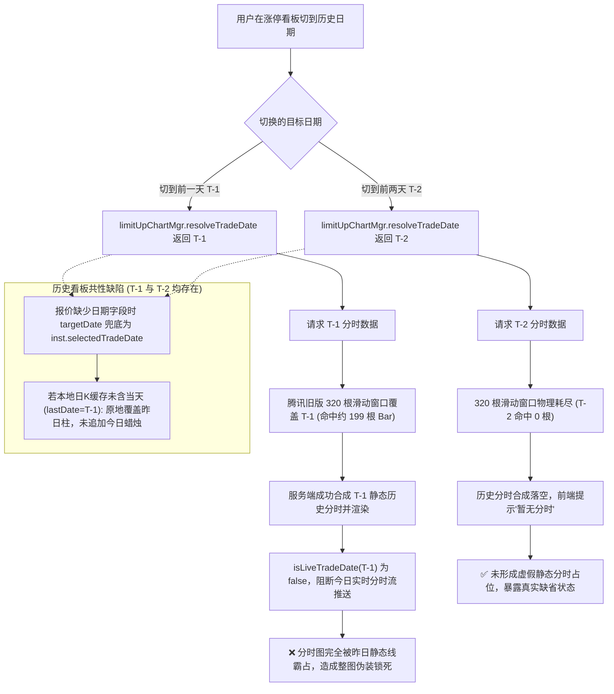

# 涨停看板切历史日期图表展示异常调查与根因方案交接

## 1. 背景与问题定义

在涨停看板（`#/limit-up`）的日期切换与图表联动中，用户反馈并实测发现以下异常现象：
- **前一天（T-1）**：当看板翻到前一个交易日（例如当前为 2026-09-14，翻到 2026-09-11），点击展开某只涨停标的的图表时，图表展示的是前一天的历史图，**完全缺少今天的日 K 蜡烛线和今天的日内分时**。
- **前两天（T-2）**：当看板翻到前两个交易日（例如 2026-09-10），展开图表时用户原始体感“能正常展示最新图”（实测日 K 正常显示且分时面板提示“暂无分时”，未被昨日历史数据伪装占领，未产生整图被昨日锁死的错觉）。
- **用户核心诉求**：涨停看板翻到历史日期主要是为了回顾过往涨停个股在“今天”的溢价、接力与持续性表现；展开图表时默认应当始终显示最新行情图（包括今日日 K 和今日分时）。用户要求全面审查图表相关逻辑，解释为什么只有前一天的图展示逻辑错误。

---

## 2. 根因深度剖析

经过对全链路代码（包括日期解析、图表控制器、分钟线合成及上游滑动窗口）的审计，确定该现象由 **业务层的人为日期锁定** 与 **上游分钟线 320 根滑动窗口机制** 共同引发。



### 2.1 机制一：`limitUpChartMgr.resolveTradeDate` 的历史日期强绑定

在 [`src/js/app.js:414-419`](file:///d:/AiPrograms/project1/market-voice-alert/src/js/app.js#L414-L419)：
```javascript
resolveTradeDate: (code, data) => {
  const dates = state.tradingDates || state.limitUp.tradingDates || [];
  const latestTradeDate = resolveLatestTradingDate(getBeijingDate(), dates);
  const isHistorical = state.limitUp.selectedDate && latestTradeDate && state.limitUp.selectedDate < latestTradeDate;
  return isHistorical ? state.limitUp.selectedDate : resolveInitialTradeDate(code, data);
}
```
自选监控页（[`monitorChartMgr`](file:///d:/AiPrograms/project1/market-voice-alert/src/js/app.js#L387-L400)）始终使用 `resolveInitialTradeDate`（即最新交易日/今天）。而在以前某次缺陷修复中，开发者为 `limitUpChartMgr` 增加了当 `selectedDate < latestTradeDate` 时强制返回 `state.limitUp.selectedDate` 的逻辑，导致展开图表时 `inst.selectedTradeDate` 被硬编码为历史日期。

### 2.2 机制二：上游 1 分钟 K 线降级源的 320 根滚动滑动窗口覆盖差异（为什么偏偏前一天发生伪装锁死）

1. **分钟源接口与滑动窗口深度**：
   - 东方财富 1 分钟 K 线接口（[`buildEastmoneyKlineUrl`](file:///d:/AiPrograms/project1/market-voice-alert/server/klineService.js#L40)）参数上限设为 1000 根（`lmt=1000`）。
   - 腾讯旧版 K 线构造函数 [`buildTencentKlineUrl`](file:///d:/AiPrograms/project1/market-voice-alert/src/js/kline.js#L194)（默认参数行位于 [`kline.js:200`](file:///d:/AiPrograms/project1/market-voice-alert/src/js/kline.js#L200)）其默认限制均为 **320 根 Bar**（`lmt=320`）。
   - 在服务端实现中，分时服务（[`server/intradayService.js:203`](file:///d:/AiPrograms/project1/market-voice-alert/server/intradayService.js#L203)）在主历史源不可用时，会调用 `getCachedKline({ period: '1m' })` 降级提取历史分钟 Bar。当东财接口遇到限流冷却（`klineService.js:86-122`）而降级回退到腾讯源时，本地缓存的分钟 K 线（如 `data/cache/kline/sh600519/1m.json`，源标为 `tencent-legacy`）严格受限于这 **320 根 Bar 的滚动滑动窗口**。
2. **A 股时间尺度与滑动窗口实际分布**：
   A 股每个常规交易日包含 240 根 1 分钟 Bar（9:30-11:30 为约 121 根含开盘点，13:00-15:00 为 120 根）。在盘中运行时，320 根 Bar 的分布特性如下：
   - **当天（T）**：盘中已产生的部分 Bar 优先占据窗口顶部（例如上午 11:30 产生约 121 根 Bar）。
   - **前一天（T-1）**：窗口剩余容量（320 - 121 = 199 根）完整容纳前一交易日的大部分/全部 Bar（盘前未开盘时则为完整 240 根）。
   - **前两天（T-2）**：由于 121 + 240 = 361 > 320，前两天的数据已被物理滑出窗口，匹配项恒为 0 根。
3. **分时合成的致命差异**：
   - **当请求前一天（T-1）时**：[`server/intradayService.js:215`](file:///d:/AiPrograms/project1/market-voice-alert/server/intradayService.js#L215) 执行 `filterKlineItemsByDate(klineData.items, 'T-1')`，在 320 根窗口内**精准命中前一天的约 199~240 根 Bar**，成功拼装出前一天的静态分时走势并返回前端渲染。
   - **当请求前两天（T-2）时**：320 根窗口内匹配项为 0。在 AKTools 历史分钟源未就绪时，无法拼装出走势，返回空数据或报错。
4. **实时推送切断**：
   当 `inst.selectedTradeDate` 被锁定为历史日期（无论是 T-1 还是 T-2）后，[`src/js/marketSession.js:138`](file:///d:/AiPrograms/project1/market-voice-alert/src/js/marketSession.js#L138) 的 `isLiveTradeDate(selectedDate)` 判定非当日返回 `false`，导致 [`chartRowController.js:135`](file:///d:/AiPrograms/project1/market-voice-alert/src/js/controllers/chartRowController.js#L135) 和 [`app.js:1324`](file:///d:/AiPrograms/project1/market-voice-alert/src/js/app.js#L1324) 彻底拒收并跳过今日的一切实时分时注入。

### 2.3 机制三：日 K 的 `applyLiveQuoteToKline` 覆盖逻辑（历史看板通用缺陷）

在 [`src/js/controllers/chartRowController.js:380-389`](file:///d:/AiPrograms/project1/market-voice-alert/src/js/controllers/chartRowController.js#L380-L389)：
```javascript
const targetDate = q.tradingDay || q.date || q.quoteDate || inst.selectedTradeDate || getBeijingDate();
const quoteForKline = (q.tradingDay || q.quoteDate || q.date) ? q : { ...q, date: targetDate };
const merged = applyLiveQuoteToKline(inst.klineData.items, quoteForKline, inst.period);
```
当股票报价缺少显式日期字段时（例如东财快照行情流缺少 `tradingDay/date/quoteDate`），`targetDate` 兜底取了 `inst.selectedTradeDate`。
传入 [`src/js/kline.js:402`](file:///d:/AiPrograms/project1/market-voice-alert/src/js/kline.js#L402) 的 `applyLiveQuoteToKline`（分支判断位于 [`kline.js:420`](file:///d:/AiPrograms/project1/market-voice-alert/src/js/kline.js#L420)）：
```javascript
if (period === '1d' && lastDate && targetDate && lastDate < targetDate) {
  return [...items, newBar]; // 追加今日新蜡烛
}
// 否则：原地修改最后一根 Bar！
const updated = { ...last, close: price };
return [...items.slice(0, -1), updated];
```
- **触发前置条件**：
  1. 日 K 缓存处于未含当天状态（如依据 1 小时 TTL 命中盘前生成的静态日 K 缓存文件，`lastDate = 'T-1'`）；
  2. 行情源未提供独立日期字段，`targetDate` 退化取历史日期 `selectedTradeDate`。
- **共性缺陷定性（核心澄清）**：
  在满足上述条件时，`lastDate < targetDate` 判定恒为 `false`（对于 T-1 看板，`T-1 < T-1` 为假；对于 T-2 看板，`T-1 < T-2` 亦为假）。**系统没有为今天追加新蜡烛 Bar，反而把最后一根柱子原地覆盖成了今天的现价**。
  **因此，日 K 报价覆盖缺陷是所有历史看板（T-1 与 T-2）共有的底层问题，并非 T-1 独有。**

### 2.4 掩盖点：`isLatestKlineDate` 的逻辑假阳性

在 [`src/js/app.js:714-719`](file:///d:/AiPrograms/project1/market-voice-alert/src/js/app.js#L714-L719)：
```javascript
function isLatestKlineDate(inst, date) {
  if (!date) return false;
  if (isLimitUpDateToday(date)) return true;
  if (!inst || !inst.klineData || !Array.isArray(inst.klineData.items)) return false;
  return getLastKlineDate(inst.klineData.items) === date;
}
```
当日 K 最后一根 Bar 为前一天时，传入前一天 `date`，`getLastKlineDate === date` 判定为 `true`。系统误以为“昨天就是最新日期”，形成了闭环假象。

---

## 3. 为什么用户会觉得“只有前一天展示错误，前两天没有问题”？

由于日 K 覆盖逻辑对 T-1 与 T-2 是对称的，**导致用户体验出现巨大反差的真正元凶，是分时图的“伪装占领”机制**：

1. **前一天（T-1）：“假分时”成功装填，达成整图伪装锁死**：
   - 腾讯 320 根滑动窗口刚好容纳了 T-1 的 199 根分钟线，分时图画出了一条看似“极其完整、真实”的历史走势；
   - 随后 `isLiveTradeDate(T-1)` 默默关死了今日实时推送；
   - 叠加日 K 的静态展示，用户看到的是一张**表面毫无破绽、但完完全全属于昨天的全套图表**。用户期望看到今天的接力走势，却被昨天的假分时死死占领，因而强烈感知到“展示的是前一天的图，少了今天的分时和K线”。
2. **前两天（T-2）：滑动窗口物理耗尽，假象闭环被当场击穿**：
   - T-2 跌出了 320 根滑动窗口的物理极限（匹配为 0 根），服务端无法合成走势，分时图直接显示“暂无分时 / 点击右侧日K查看分时”；
   - **分时图没有被假数据占领**，暴露了真实缺省状态；
   - 在网络日 K 包含当天柱（`lastDate = Today`）时，日 K 正常显示今日柱，分时提示暂无；用户并不会产生“这是一张完美的前天历史图”的错觉。
3. **结论**：
   用户感知到的“只有前一天图表展示逻辑错误”，本质上是因为 **T-1 刚好命中了 320 根分钟滑动窗口能够合成历史伪分时的临界上界**，形成了“伪静态分时 + 推送静默切断”的闭环；而 T-2 跌出了该滑动窗口，伪装链条破裂，从而避免了“整图被伪装锁死”的假象！

---

## 4. 架构优化与修复方案

### 4.1 总体架构设计与职责边界划分

要彻底根治历史日期翻页带来的图表锁死与时序混乱，必须确立清晰的系统职责边界与设计原则：

1. **状态职责正交分离（核心原则）**：
   - **看板列表筛选日期（`state.limitUp.selectedDate`）**：其职责仅限于**涨停股票列表的数据集过滤与历史回溯**（即筛选出指定历史交易日上榜的标的池）。
   - **图表实例初始日期（`inst.selectedTradeDate`）**：展开图表的核心用户诉求是**复盘过往涨停标的在“当下”的溢价、接力与最新价格走势**。因此，无论列表当前筛选哪一天，新展开的图表默认**必须且只能以最新可用交易日（`latestTradingDay` / 今日）作为初始上下文**，严禁被列表的筛选日期劫持。
2. **主动下钻 vs 默认呈现**：
   - **默认呈现**：展开即展示当下全量日 K 与今日最新分时（具备实时 Tick 注入与定时刷新）。
   - **主动下钻通道**：保留并依托成熟的原生交互能力——用户若确需回溯某历史日期的分时细节，在右侧日 K 图中主动点击对应历史蜡烛柱（[`chartRowController.handleKlineBarClick`](file:///d:/AiPrograms/project1/market-voice-alert/src/js/controllers/chartRowController.js#L491)），由显式的人机交互触发分时切换。
3. **实时时钟防污染契约**：
   - 实时行情（Live Quote）在语义上恒为“当前最新的市场报价”，其对应的 K 线目标日期必须锚定**交易日历的当前交易日**（[`resolveStockChartDate`](file:///d:/AiPrograms/project1/market-voice-alert/src/js/tradeCalendar.js#L118)），绝不允许退化回退到实例可能持有的历史 `selectedTradeDate`。

---

### 4.2 具体改动点与实施细则（含代码变更对比）

#### 改造点一：统一图表交易日解析契约（移除看板历史日期劫持）
- **涉及文件**：[`src/js/app.js:414-419`](file:///d:/AiPrograms/project1/market-voice-alert/src/js/app.js#L414-L419)
- **问题现状**：
  目前 `limitUpChartMgr` 的 `resolveTradeDate` 检查 `isHistorical`，若看板处于历史日期则强行返回 `state.limitUp.selectedDate`，导致实例初始化时 `selectedTradeDate` 被硬编码为历史日期。
- **改动方案**：
  将 `limitUpChartMgr` 的 `resolveTradeDate` 调整为与自选监控页 [`monitorChartMgr`](file:///d:/AiPrograms/project1/market-voice-alert/src/js/app.js#L387-L400) 保持完全一致，统一直接委托给 `resolveInitialTradeDate(code, data)`。
- **代码对比**：
  ```javascript
  // 修改前 (src/js/app.js:414-419)
  resolveTradeDate: (code, data) => {
    const dates = state.tradingDates || state.limitUp.tradingDates || [];
    const latestTradeDate = resolveLatestTradingDate(getBeijingDate(), dates);
    const isHistorical = state.limitUp.selectedDate && latestTradeDate && state.limitUp.selectedDate < latestTradeDate;
    return isHistorical ? state.limitUp.selectedDate : resolveInitialTradeDate(code, data);
  },

  // 修改后 (src/js/app.js)
  resolveTradeDate: (code, data) => resolveInitialTradeDate(code, data),
  ```
- **技术效果**：
  - 无论看板翻到 T-1、T-2 还是更早，点击展开图表时，`selectedTradeDate` 始终被解析为最新交易日。
  - 分时图直接请求今日分时数据，绝不向服务端请求历史分时，从根源上杜绝了 320 根滑动窗口合成历史伪分时、并将图表锁死在昨日静态数据的行为。

#### 改造点二：实时报价目标日期防污染（消除日 K 原地覆盖陷阱）
- **涉及文件**：[`src/js/controllers/chartRowController.js:380-389`](file:///d:/AiPrograms/project1/market-voice-alert/src/js/controllers/chartRowController.js#L380-L389)
- **问题现状**：
  在日 K 加载完成合并实时报价时，`targetDate` 兜底链中包含了 `inst.selectedTradeDate`。一旦实例被设为历史日期且报价缺少显式日期字段，`targetDate` 退化为历史日期，触发 [`kline.js:420`](file:///d:/AiPrograms/project1/market-voice-alert/src/js/kline.js#L420) 的 `lastDate < targetDate = false`，导致昨日柱被原地覆盖、今日蜡烛丢失。
- **改动方案**：
  实时报价的日期兜底必须优先取当前交易日（引入 [`resolveStockChartDate`](file:///d:/AiPrograms/project1/market-voice-alert/src/js/tradeCalendar.js#L118) 或 `getBeijingDate`），彻底移除对 `inst.selectedTradeDate` 的回退依赖。
- **代码对比**：
  ```javascript
  // 修改前 (src/js/controllers/chartRowController.js:383)
  const targetDate = q.tradingDay || q.date || q.quoteDate || inst.selectedTradeDate || getBeijingDate();

  // 修改后 (src/js/controllers/chartRowController.js)
  const liveChartDate = resolveStockChartDate(this.getTradingDates()) || getBeijingDate();
  const targetDate = q.tradingDay || q.date || q.quoteDate || liveChartDate;
  ```
- **技术效果**：
  - 即使图表当前正处于用户主动切换的历史分时查看状态（`inst.selectedTradeDate` 为历史日期），接收到的实时报价仍然以今日市场日期作为 `targetDate`。
  - 在 [`src/js/kline.js:402`](file:///d:/AiPrograms/project1/market-voice-alert/src/js/kline.js#L402) 中，`lastDate < targetDate` 判定始终为 `true`，系统正常为今天追加（或更新）最新的日 K 蜡烛柱，绝不会意外污染覆盖历史收盘柱。

#### 改造点三：历史下钻与实时监控的双向平滑切换机制
- **涉及文件**：[`src/js/controllers/chartRowController.js:491-505`](file:///d:/AiPrograms/project1/market-voice-alert/src/js/controllers/chartRowController.js#L491-L505)
- **交互流程保障**：
  1. **主动查看历史**：用户在日 K 上点击历史 Bar，`handleKlineBarClick` 捕获点击日期并更新 `inst.selectedTradeDate`，发起 `loadIntraday(code, date)` 加载该历史日期的分时。此时 [`isLiveTradeDate(selectedDate)`](file:///d:/AiPrograms/project1/market-voice-alert/src/js/marketSession.js#L138) 为 `false`，实时 Tick 自动阻断，分时状态文本明确标识该历史日期点数。
  2. **快速回到最新**：用户点击最右侧当天的日 K 柱子，`selectedTradeDate` 瞬间切换回今日，`loadIntraday` 重新加载今日全天分时。此时 `isLiveTradeDate` 恢复为 `true`，后续所有实时 Tick 增量推送立即无缝恢复注入。
  3. **重新展开重置**：用户折叠行再重新展开，始终触发初始化逻辑，稳定重置并呈现最新行情，不残留上次的历史下钻状态。

---

### 4.3 自动化测试与质量保障方案

为确保架构优化落地且绝不发生回归，需在现有 814 个测试用例基础上扩展以下针对性测试矩阵：

1. **涨停看板图表初始化交易日单测**（扩展 `tests/chartRowController.test.js` 或新建 `tests/limitUpChartInit.test.js`）：
   - **用例 1**：模拟 `state.limitUp.selectedDate = '2026-09-11'`（T-1），实例化 `limitUpChartMgr` 并调用 `ensureChart(code)`，断言实例的 `selectedTradeDate` 为当前最新交易日（`2026-09-14`），而非 `2026-09-11`。
   - **用例 2**：模拟 `state.limitUp.selectedDate = '2026-09-10'`（T-2），同样断言初始化的 `selectedTradeDate` 为最新交易日。
2. **实时报价日期防污染与追加日 K 蜡烛单测**（扩展 `tests/chartRowController.test.js`）：
   - **用例 3**：构造 `inst.selectedTradeDate = '2026-09-11'`（模拟用户正在看历史分时），注入不带日期字段的纯价格报价 `{ price: 21.00 }`。断言合并后的日 K 数据项数量增加 1 根（追加了 `2026-09-14` 的新 Bar），且上一根（`2026-09-11`）的收盘价保持原样未被覆盖。
3. **历史分时点击下钻与回归今日的闭环测试**：
   - **用例 4**：模拟点击历史柱子，验证 `selectedTradeDate` 改变且 `loadIntraday` 被调用；再模拟点击最新柱子，验证 `selectedTradeDate` 回归且 `isLiveTradeDate` 恢复为 `true`。

---

### 4.4 风险评估与发布保障

- **风险等级**：**低（Low）**。
  - 改动严格受控在前端图表控制器的初始日期决策与报价合并日期兜底两个局部点位。
  - 不涉及服务端接口改动，不影响涨停板核心筛选、语音告警、主监控表格等业务链路。
- **向下兼容性**：**100% 兼容**。
  - 完全保留用户通过日 K 柱子主动下钻查阅历史分时的全部既有功能。
- **验证与回滚预案**：
  - 实施时先运行全量测试套件保证基线不坏；
  - 若在生产验证阶段发现任何未预期的行为偏差，仅需回滚两处代码即可安全恢复至改动前状态。
