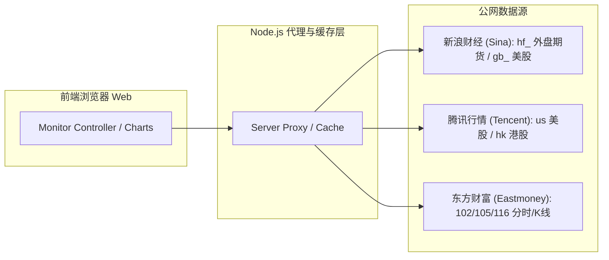
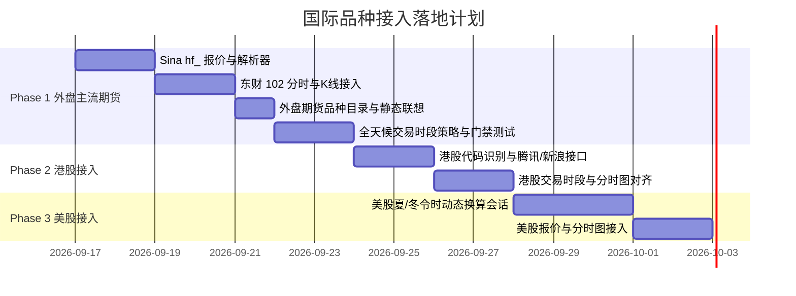

# 国际期货与国际股票接入可行性调研与架构设计方案 (Handoff)

> **文档性质**：需求可行性调研、系统架构演进规划与分阶段实施方案  
> **适用项目**：股票期货实时监控助手 (`market-voice-alert`)  
> **日期**：2026-09-16  
> **状态**：方案提出，待多智能体独立审查

---

## 1. 背景与目标

### 1.1 历史边界梳理
在项目早期的技术规格文档及需求规划中：
1. [`SPEC.md`](../../SPEC.md)：核心定位为“实时监控中国A股、期货市场价格”，代码规范仅支持 `sh`/`sz`/`bj` 前缀。
2. [`docs/plans/2026-09-03-futures-requirements-technical-plan.md`](../plans/2026-09-03-futures-requirements-technical-plan.md)：§3.2 与 §12.1 明确将“外盘期货、外汇、数字货币、期权”划定为 Out of Scope，仅支持中国境内六家期货交易场所（上期所、上期能源、大商所、郑商所、广期所、中金所）。
3. [`docs/requirements-stock-search-suggest.md`](../requirements-stock-search-suggest.md)：§1.1 明确“ETF、指数、债券、B 股、港美股名称联想及完整月份合约目录不在本期范围”。

### 1.2 本方案演进诉求
随着用户监控需求的拓展，现评估将监控范围延伸至**国际/外盘主流期货**（如美原油、COMEX 黄金、美白银、美铜、纳斯达克100期货、标普500期货、富时A50、恒指期货等）以及**国际股票**（港股、美股）的可行性，并确立低风险、模块化解耦的演进方案。

---

## 2. 外部数据源可行性（现场实测验证）

经 2026-09-16 现场实测，公网免费低延迟数据源（新浪财经、腾讯行情、东方财富）对目标国际品种均有完备覆盖：



### 2.1 国际期货（外盘期货）实测
* **实时报价**：新浪外盘期货接口 `https://hq.sinajs.cn/list=hf_CL,hf_GC,hf_NQ,hf_SI`
  * 实测响应延时 `< 100ms`，直出原生字段：
    `var hq_str_hf_CL="99.903,,99.940,99.960,100.610,99.360,13:58:38,100.750,100.460,0,1,17,2026-09-16,纽约原油,0";`
  * 字段映射：`[现价, _, 买一, 卖一, 最高, 最低, 报价时间, 昨结, 今开, 持仓量, _, _, 报价日期, 品种中文名, _]`。
* **分时走势与历史 K 线**：东方财富接口 `https://push2.eastmoney.com/api/qt/stock/trends2/get?secid=102.CL00Y`
  * 实测返回 470 根分钟分时点，结构与现有 A 股/内盘期货完全一致。

### 2.2 港股（HK Stocks）实测
* **实时报价**：腾讯 `https://qt.gtimg.cn/q=r_hk00700` 或新浪 `https://hq.sinajs.cn/list=rt_hk00700`
  * 字段包含昨收、今开、现价、最高、最低、成交额、成交量、更新时间，支持五位港股代码。
* **分时走势与历史 K 线**：东财 `secid=116.00700`
  * 实测返回 240 根分钟走势（09:30-12:00, 13:00-16:00）。

### 2.3 美股（US Stocks）实测
* **实时报价**：腾讯 `https://qt.gtimg.cn/q=usAAPL` 或新浪 `https://hq.sinajs.cn/list=gb_aapl`
  * 支持常规时段报价及盘前盘后价格提取。
* **分时走势与历史 K 线**：东财 `secid=105.AAPL`（纳斯达克）/ `secid=106.BABA`（纽交所）
  * 实测返回美东 09:30-16:00 对应北京时间 21:30-04:00 的 391 根分钟走势。

---

## 3. 系统核心改造点与架构设计

### 3.1 资产领域模型（Domain Model）扩展
在 `src/js/parser.js` 与 `src/js/services/` 中建立统一资产类型：

```js
export const ASSET_TYPES = Object.freeze({
  STOCK_CN: 'stock_cn',     // A股 (sh600519, sz000001, bj830001)
  FUTURES_CN: 'futures_cn', // 国内期货 (RB0, IF2603)
  FUTURES_GLOBAL: 'futures_global', // 外盘期货 (hf_CL, hf_GC, hf_NQ)
  STOCK_HK: 'stock_hk',     // 港股 (hk00700, hk09988)
  STOCK_US: 'stock_us'      // 美股 (usAAPL, usTSLA, usNVDA)
});
```

* **归一化函数（`normalizeCode`）增强**：
  * `hk\d{5}` -> 标记为 `stock_hk`
  * `us[A-Za-z]+` -> 标记为 `stock_us`
  * `hf_[A-Za-z]+` 或已知外盘符号（如 `CL0`, `GC0`, `NQ0`） -> 标记为 `futures_global`
* **东财 `secid` 映射扩展（`toEastmoneySecId`）**：
  * 港股：`116.${code.slice(2)}`
  * 美股：根据 Ticker 所属交易所映射 `105.` (NASDAQ) 或 `106.` (NYSE)
  * 外盘期货：映射 `102.${symbol}00Y` (主连)

### 3.2 交易会话与日历解耦（策略模式）
针对此前多轮审查中已高度闭环的国内 A 股与国内期货会话模型（避免破坏性回归），必须使用**独立会话策略（Session Strategy）**进行隔离：

1. **`ChinaStockSessionStrategy`**：保持既有 09:30-11:30, 13:00-15:00 逻辑不变。
2. **`ChinaFuturesSessionStrategy`**：保持既有日夜盘、节假日前夜无夜盘、品种差异化闭市逻辑不变。
3. **`HkStockSessionStrategy`**：
   * 交易时段：早盘 09:30-12:00，午盘 13:00-16:00；
   * 独立香港交易日历（剔除复活节、佛诞等港股休市日）。
4. **`UsStockSessionStrategy`**：
   * 夏令时（EDT）：北京时间 21:30 - 次日 04:00；
   * 冬令时（EST）：北京时间 22:30 - 次日 05:00；
   * 具备纯函数 `isUsDaylightSavingTime(date)` 自动换算；
   * 盘前（16:00-开盘）与盘后（收盘-08:00）状态标识。
5. **`GlobalFuturesSessionStrategy`**：
   * CME/ICE 电子盘基本处于近 24 小时交易状态（周一 06:00 至周六 05:00/06:00）；
   * 每日仅有 1 小时结算休市窗口（北京时间 05:00-06:00 或 06:00-07:00）；
   * 调度逻辑极度简化，大部分时段允许实时行情轮询。

### 3.3 图表渲染与时间轴适配
* **TradingView Lightweight Charts**：
  * 底层基于秒级 Unix 时间戳，天然不受北京时间或美东时间跨日限制；
  * 分时图自适应总根数：
    * A 股：240 根
    * 港股：330 根
    * 美股：390 根
    * 外盘期货：采用滚动 24 小时滑动窗口或以结算日为界的跨度。

### 3.4 语音播报（TTS）与告警适配
* **货币单位自适应**：
  * `stock_cn` / `futures_cn`: “元”
  * `stock_hk`: “港币”
  * `stock_us` / `futures_global`: “美元”
* **标的读音**：
  * 美股代码（如 `AAPL`）在有中文名时优先播报中文名“苹果”，无中文名时播报英文字母；
  * 外盘期货直接播报品名（如“纽约原油”、“纽约黄金”）。

### 3.5 搜索词库与输入联想策略
* **外盘期货**：核心主流品种仅约 30~50 个，完全可以直接静态内置于本地词典，支持拼音与中文直搜（如输入 `meiyuanyou` / `myy` / `ny原油` 均能联想到 `hf_CL`）。
* **港美股**：全量标的过万只，首版采取分级策略：
  1. 代码全量支持直接输入添加（如 `hk00700`、`usAAPL`）；
  2. 本地静态词典仅内置高频头部权重股（恒生科技成份股 + 标普500/纳指100核心股）。

---

## 4. 推荐落地实施路线图（Roadmap）



### Phase 1: 外盘主流期货接入（性价比最高、见效最快）
* **优势**：品种集中（30+ 个核心品种），Sina 接口极度轻量稳定，交易时间全天连续无复杂日夜割裂，东财分时数据结构完美兼容。
* **交付范围**：
  * 纽约原油 (`CL0`)、COMEX 黄金 (`GC0`)、白银 (`SI0`)、美铜 (`HG0`)、天然气 (`NG0`)；
  * 纳指期货 (`NQ0`)、标普期货 (`ES0`)、道指期货 (`YM0`)、富时A50 (`CHA500`) 等。

### Phase 2: 港股接入
* **优势**：与北京时间完全同区，无时差转换负担，仅午休与闭市时间略有差异。

### Phase 3: 美股接入
* **优势**：覆盖全球科技巨头股票，核心攻关在于夏冬令时动态换算与盘前盘后时段支持。

---

## 5. 验收标准与门禁规范

1. **防回归红线**：
   * 改造过程中，既有 A 股（843 项 QUnit 单元测试与 75 项 Playwright E2E 测试）及国内期货夜盘/停播补播规则**必须全部保持 100% PASS**。
2. **新增资产测试矩阵**：
   * 覆盖外盘期货、港股、美股各至少 3 个典型标的的解析、分时加载、日K线获取与 TTS 语音播报断言；
   * 时段策略测试：覆盖美股夏令时/冬令时切换日期、港股半日休市、外盘期货结算暂停时钟。
3. **性能红线**：
   * 客户端包体体积不因新增资产词典发生显著膨胀（词库增量控制在 `< 150KB`）；
   * 行情轮询单批次延时 `< 300ms`。
